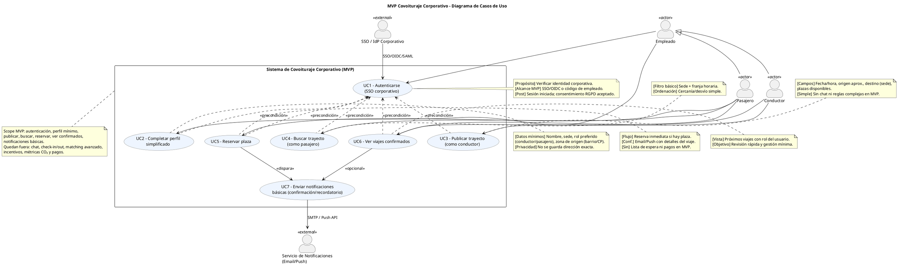
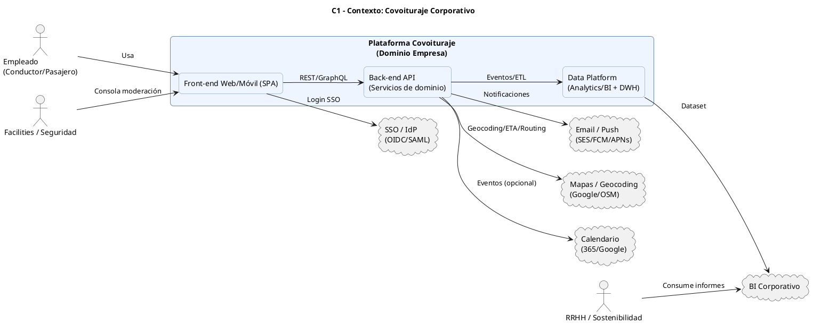
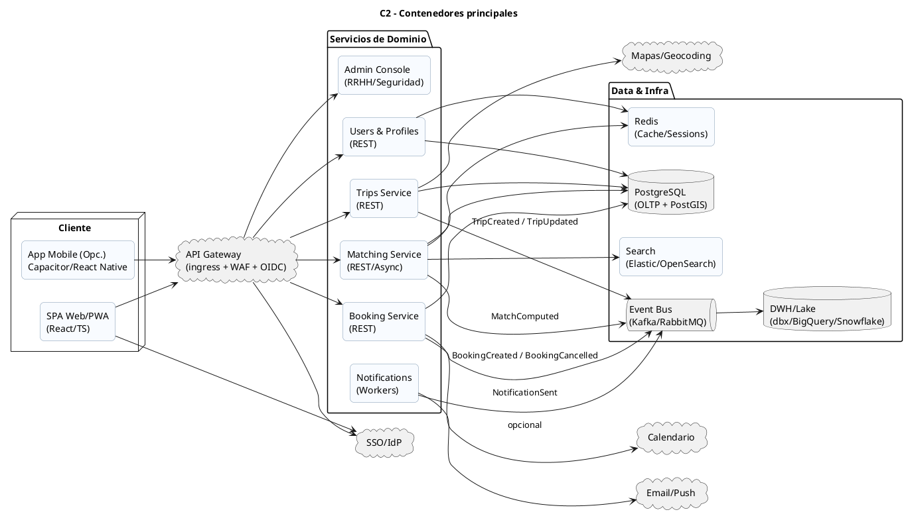
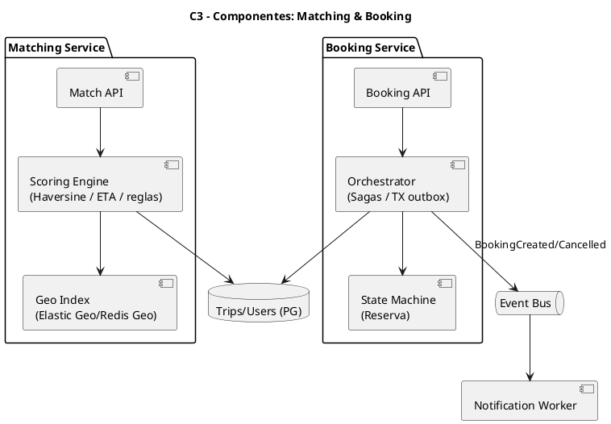
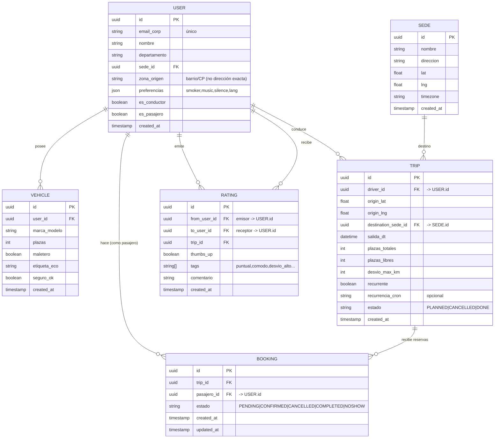

# 1 Investigación y análisis de requisitos

## Xavier Vergés Berga
Eres un experto en producto, con experiencia en aplicaciones de Covoituraje.

Estoy pensando en desarrollar una aplicacion de Covituraje para los empleados de una compañía. La idea és dar servicio a los empleados que necesiten desplazarse para llegar al trabajo o volver a casa y también para desplazamientos puntuales.

 ¿Qué funcionalidades básicas tiene un Covituraje de este tipo? Descríbemelas en un listado, ordenado de mayor a menor prioridad.

 ## ChatGPT 5

 Perfecto 🚀. Si hablamos de un **covoituraje corporativo** (para empleados de una misma compañía), las funcionalidades básicas se organizan por prioridad en función de lo imprescindible para que el servicio tenga uso real y adopción rápida.

Aquí tienes el **listado ordenado** (de más prioritario a menos):

---

### 🔝 Funcionalidades esenciales (MVP)

1. **Registro e inicio de sesión corporativo**

   * Acceso con credenciales de la empresa (SSO, Google Workspace, Microsoft, LDAP).
   * Garantiza que solo empleados puedan usar la app.

2. **Perfil de usuario**

   * Nombre, foto opcional, puesto/departamento.
   * Dirección aproximada de residencia (zona, barrio, no exacta por privacidad).
   * Preferencias de viaje (fumador/no fumador, música, horarios flexibles, etc.).

3. **Creación de viajes**

   * El empleado puede publicar que **conduce** o que **necesita un viaje**.
   * Definir: punto de salida, destino (sede de la empresa), hora, plazas disponibles.

4. **Búsqueda y emparejamiento de viajes**

   * Motor que sugiera coincidencias entre conductores y pasajeros.
   * Filtrar por horario, zona de recogida, idioma, afinidades.

5. **Reserva de plaza**

   * Un clic para unirse al viaje.
   * Confirmación automática o aprobación del conductor.

6. **Notificaciones en tiempo real**

   * Avisos de nuevas coincidencias.
   * Recordatorios antes del viaje.
   * Cancelaciones o retrasos.

---

### ⚙️ Funcionalidades importantes (segunda prioridad)

7. **Mapa y geolocalización básica**

   * Visualizar rutas sugeridas y puntos de encuentro.
   * No es necesario navegación avanzada al principio (se puede usar Google Maps/Waze).

8. **Historial de viajes**

   * Para repetir rápidamente un trayecto habitual.
   * Estadísticas de viajes compartidos.

9. **Sistema de confianza interno**

   * Valoraciones simples (👍 / 👎).
   * Etiquetas de comportamiento: puntual, buen copiloto, etc.

10. **Privacidad avanzada**

* Mostrar solo zona aproximada de residencia (no dirección exacta).
* Opción de ocultar número de teléfono y usar chat interno de la app.

---

### 🌱 Funcionalidades de valor añadido (tercera prioridad)

11. **Integración con calendario corporativo**

* Detectar horarios de entrada/salida, reuniones en otra sede.

12. **Gamificación / incentivos**

* Ranking de empleados que más comparten coche.
* Puntos canjeables por beneficios internos (comedor, vales, etc.).

13. **Compartición de costes**

* Cálculo automático del coste estimado (combustible, peajes).
* Transferencia interna (aunque muchas empresas optan por gratuidad).

14. **Soporte para desplazamientos puntuales**

* Ejemplo: viajes a eventos corporativos, visitas a otras oficinas.

15. **Reportes para RRHH / Sostenibilidad**

* Estadísticas agregadas de CO₂ ahorrado, ahorro de costes de parking, etc.
* Datos anónimos para informes de RSC y medio ambiente.

---

📌 En resumen:

* Para un **MVP** necesitas: registro seguro, creación/búsqueda de viajes, reserva de plazas y notificaciones.
* Luego añades **mapas, historial, reputación y privacidad**.
* Y como tercera capa, las **integraciones, incentivos y métricas corporativas**.

---

¿Quieres que te lo prepare en un **roadmap por fases (Fase 1, 2, 3)** para que quede claro cómo priorizar el desarrollo?

### Cobertura del plan para las 15 funcionalidades (estado y próximos pasos)

| # | Funcionalidad | Cobertura en plan | Estado actual | Próximos pasos |
|---|----------------|-------------------|---------------|----------------|
| 1 | Registro e inicio de sesión corporativo (SSO) | Sí (OIDC/Keycloak) | Backend OIDC listo; FE login en validación | Re-ejecutar auth E2E tras fix CORS; ajustar FE si necesario |
| 2 | Perfil de usuario | Sí (Users Service) | API `GET/PUT /users/me` implementada | Completar UI perfil; validaciones y tests FE |
| 3 | Creación de viajes | Sí (Trips Service) | API trips con JPA | Completar UI crear/gestionar viajes; tests |
| 4 | Búsqueda y emparejamiento | Sí (Matching Service) | Matching básico | UI búsqueda + mostrar scoring; filtros básicos |
| 5 | Reserva de plaza | Sí (Booking Service) | API bookings con estados | UI reservar/cancelar; reglas autoaceptación básica |
| 6 | Notificaciones en tiempo real | Parcial (Notifications plan) | Hooks definidos; sin worker | Implementar worker simple email; preparar push later |
| 7 | Mapa y geolocalización básica | No explícito (implícito en UI futura) | No iniciado | Añadir en plan: mapa sencillo y enlaces a Maps/Waze |
| 8 | Historial de viajes | Parcial (Trips/Bookings list) | Listas base | Añadir filtros/estadísticas simples |
| 9 | Sistema de confianza interno | Plan (Ratings) | Modelo `Rating` definido | API/FE para thumbs y tags básicas |
| 10 | Privacidad avanzada | Sí (zona aprox., chat interno) | Zona aprox. en perfil | Añadir controles de visibilidad y chat interno later |
| 11 | Integración calendario corporativo | Plan (opcional) | No iniciado | Crear hook iCal/Outlook simple (descarga .ics) |
| 12 | Gamificación / incentivos | Plan (opcional) | No iniciado | Bocetar puntos/badges; métricas base |
| 13 | Compartición de costes | Plan (opcional) | No iniciado | Cálculo estimado y marcado “beneficio empresa” |
| 14 | Desplazamientos puntuales | Sí (Trips puntuales) | Soportado por Trips | UI específica “evento” con fecha/hora |
| 15 | Reportes RRHH / Sostenibilidad | Sí (Analytics plan) | Métricas base planificadas | Endpoint métricas agregadas + dashboard básico |

Notas:
- CORS corregido en backend; `ALLOWED_ORIGINS` configurado en compose; FE dev `.env.local` actualizado.
- Reejecutar suite de auth E2E para validar login y llamadas a `/users/me`.

### Roadmap actualizado (por fases)

- Fase MVP (esencial): 1, 2, 3, 4 (básico), 5, 6 (email simple), 14
- Fase 2 (importante): 7, 8, 9, 10, 15 (panel básico)
- Fase 3 (valor añadido): 11, 12, 13, 4 avanzado (scoring/ETA)

## Xavier Vergés Berga

Antes de preparar el roadmap, investiga que alternativas existen en el mercado e indica que ventajas podemos aportar con una aplicación propia

## ChatGPT 5

Aquí tienes un resumen tras investigar las **alternativas existentes** en el mercado para apps de covoituraje corporativo, junto con las **ventajas** que podrías aportar al desarrollar una solución propia:

---

## Alternativas en el mercado para covoituraje corporativo

1. **Hoop Carpool**
   Plataforma líder en España, México, Colombia y Portugal para compartir coche entre empleados o estudiantes. Ofrece gestión de trayectos y paneles de control de emisiones. Requiere un convenio con la empresa para su uso. ([Hoop Carpool][1], [Google Play][2])

2. **KINTO Join**
   Orientada a la sostenibilidad, conecta rutas similares e integra desplazamientos a pie o bicicleta. Permite rastrear en tiempo real el ahorro de CO₂ y contribuciones medioambientales, incentivando el uso sostenible. ([Kinto Mobility][3])

3. **Poola**
   Programa corporativo que promueve y recompensa el comportamiento de carpooling. Facilita simulaciones, calcula beneficios y promueve la implementación en empresas. ([Poola.app][4])

4. **Hybo**
   Software orientado a equipos de trabajo, facilita publicación y búsqueda de rutas dentro de la empresa. Ofrece configuración avanzada y filtrado automático. ([Hybo][5])

5. **VIPDistrict (Carpooling corporativo)**
   Plataforma exclusiva para empresas, con funciones para definir periodicidad, filtros geográficos, aceptación automática/manual, y enfoque en seguridad y sostenibilidad. ([Vip District][6])

6. **Scoop Commute**
   Conecta empleados y vecinos para carpooling seguro y fiable; está presente como referencia en EE.UU. ([Scoop Commute][7])

7. **RidePal**
   Sistema de vanpooling corporativo con autobuses de entre 30 y 40 plazas, asientos de cuero, Wi-Fi y rutas planificadas según demanda. ([Wikipedia][8])

8. **Carma**
   App de carpooling en tiempo real con geolocalización, emparejamiento de trayectos y división de costes; conocida por su eficiencia en desplazamientos urbanos. ([Wikipedia][9])

9. **Otros players generales (no necesariamente corporativos)**

   * *BlaBlaCar*: referente en carpooling entre ciudades, comunidad amplia, sistema de perfiles y puntuaciones. ([Wikipedia][10])
   * *Zify*, *Swvl*, *Waze Carpool*, *Amovens*, etc., ofrecen modelos variados de compartición en distintos mercados ([Wikipedia][11], [Lowi][12], [Vanity Fair][13]).

10. **Iniciativas concretas en empresas**
    Empresas como **Babel** han implementado Hoop Carpool para sus empleados en Málaga, ofreciendo viajes compartidos gratuitos o con descuento; se busca reducir emisiones, costes y promover bienestar laboral ([Cadena SER][14]).
    También hay grandes corporaciones como **Banco Santander** que fomentan el carpooling dentro de políticas más amplias de movilidad sostenible, combinando lanzaderas, recargas eléctricas y métricas de impacto ambiental ([El País][15]).

---

## ¿Qué ventajas podría aportar una aplicación propia?

Al desarrollar tu propia app corporativa de covoituraje, puedes diferenciarte de estas alternativas con las siguientes ventajas clave:

1. **Adaptación a cultura corporativa interna**
   Totalmente alineada con los valores, políticas internas, lenguaje y procesos de la empresa (por ejemplo, branding personalizado, integración con RRHH, calendarios corporativos, etc.).

2. **Privacidad y control de datos**
   Puedes garantizar que solo los empleados acceden (SSO, LDAP), decidir dónde se alojan los datos (on-premise o nube controlada) y evitar compartir información con terceros.

3. **Flexibilidad en políticas de uso**
   Permite definir reglas propias: aprobación manual de viajes, grupos por departamento, límites de plazas, filtros personalizados, etc., sin depender de soluciones genéricas.

4. **Integración con sistemas internos**
   Conexión directa con intranet, nóminas, calendario corporativo, apps de bienestar, sistemas de recompensas e incentivos internos, etc.

5. **Reportes personalizados para RSC y RRHH**
   Generación de informes adaptados: CO₂ evitado, reducción de plazas de parking, ahorro de costes de transporte, indicadores de adopción por equipo o sede.

6. **Modelo de incentivos internos**
   Puedes gamificar el uso según métricas corporativas: puntos canjeables por beneficios de empresa, rankings por departamento, campañas de concienciación, etc.

7. **Mejor experiencia de usuario (UX)**
   Diseñada específicamente con foco en empleados y realidades locales (ej. horarios de entrada, direcciones aproximadas por zonas residenciales), con interfaces adaptadas a cultura interna.

8. **Flexibilidad tarifaria o gratuidad total**
   Ajusta si quieres aplicar reparto de costes simbóricos, resumir en nómina, o ofrecerlo como beneficio gratuito; sin comisiones externas.

9. **Soporte especializado interno**
   Atención técnica alineada con IT corporativa, tiempos SLA personalizados, priorización de mejoras, sin depender de proveedores externos.

10. **Estrategia de cambio cultural**
    Puedes vincular el app con iniciativas de sostenibilidad, movilidad verde o políticas de Bienestar del empleado, fortaleciendo el compromiso corporativo.

---

## Conclusión

Muchas soluciones ya existentes (Hoop, KINTO Join, Hybo, Poola...) ofrecen funcionalidades básicas y valor probados. Sin embargo, una **app propia** te da control exclusivo sobre datos, personalización, integración y flexibilidad, alineándose con tus necesidades estratégicas y culturales.

Esto no solo mejora la adopción interna, sino que también permite que esta herramienta sea parte de la identidad y objetivos de la empresa, especialmente en sostenibilidad y bienestar.

---

¿Quieres ahora que prepare un **roadmap en fases**, teniendo en cuenta estas alternativas y ventajas estratégicas?

[1]: https://www.hoopcarpool.com/?utm_source=chatgpt.com "Hoop Carpool - Plataforma de carpooling"
[2]: https://play.google.com/store/apps/details?hl=es_US&id=com.hoopcarpool&utm_source=chatgpt.com "Hoop Carpool - Compartir coche - Apps en Google Play"
[3]: https://www.kinto-mobility.eu/es/es/kinto-join?utm_source=chatgpt.com "Revoluciona el transporte para tus empleados – KINTO Join"
[4]: https://poola.app/corporate-carpooling-program/?utm_source=chatgpt.com "Corporate Carpooling Program"
[5]: https://hybo.app/software-para-compartir-coche-entre-companeros/?utm_source=chatgpt.com "Software para compartir coche entre compañeros - Hybo"
[6]: https://vipdistrict.com/es/productos/carpooling/?utm_source=chatgpt.com "Plataforma corporativa para compartir coche para ir a trabajar"
[7]: https://www.scoopcommute.com/?utm_source=chatgpt.com "Scoop Commute: Carpooling Software"
[8]: https://en.wikipedia.org/wiki/RidePal?utm_source=chatgpt.com "RidePal"
[9]: https://en.wikipedia.org/wiki/Carma?utm_source=chatgpt.com "Carma"
[10]: https://en.wikipedia.org/wiki/BlaBlaCar?utm_source=chatgpt.com "BlaBlaCar"
[11]: https://en.wikipedia.org/wiki/Zify?utm_source=chatgpt.com "Zify"
[12]: https://www.lowi.es/blog/apps-compartir-coche/?utm_source=chatgpt.com "Las 4 mejores aplicaciones para compartir coche - Lowi"
[13]: https://www.vanityfair.com/news/2016/05/google-and-uber-go-head-to-head-in-carpooling?utm_source=chatgpt.com "Google and Uber Go Head-to-Head in Carpooling"
[14]: https://cadenaser.com/andalucia/2025/05/05/primera-empresa-de-malaga-que-ofrece-coche-compartido-gratuito-a-sus-empleados-ser-malaga/?utm_source=chatgpt.com "Primera empresa de Málaga que ofrece coche compartido gratuito a sus empleados"
[15]: https://elpais.com/proyecto-tendencias/espacio-santander/2025-07-29/lanzaderas-vehiculos-electricos-y-trayectos-compartidos-la-movilidad-empresarial-se-hace-verde.html?utm_source=chatgpt.com "Lanzaderas, vehículos eléctricos y trayectos compartidos. La movilidad empresarial se hace verde"

## Xavier Vergés Berga

Antes de preparar el roadmap ¿Cómo es el customer journey normal de un usuario que usa un sistema de covoituraje? Descríbeme paso a paso todas las interacciones

## ChatGPT 5

¡Vamos allá! Este es el **customer journey completo** para una app de **covoituraje corporativo** (empleados). Lo describo en **pasos cronológicos**, señalando diferencias entre **pasajero** y **conductor** cuando aplica.

# 1) Descubrimiento y activación

* Recibe invitación de RR. HH. (email, intranet, Teams/Slack, QR en cartelería).
* Abre la app/web y **accede por SSO** (Google/Microsoft/LDAP).
* Acepta **términos, privacidad (GDPR)** y el **código de conducta**.
* Verificación opcional: teléfono (OTP) y correo.

# 2) Onboarding inicial

* Selecciona sede(s) de trabajo.
* Define **zona de origen** (barrio/código postal, no dirección exacta).
* Indica **horarios habituales** y **tolerancias** (p. ej., ±15 min).
* Preferencias: silencio/música, fumador/no, idioma, flexibilidad.
* Si será **conductor**: añade vehículo (plazas, maletero, matrícula opcional), días que conduce, seguro vigente.
* Elige **rol predeterminado**: pasajero, conductor o ambos.

# 3) Configurar trayectos

* **Recurrente (commute)**: L–V, hora ida/vuelta, ventanas de flexibilidad, puntos de encuentro preferidos.
* **Puntual/evento**: fecha/hora específicas, origen/destino (otra sede, evento).
* Opcional: geocercas de pickup (paradas, parkings, estaciones).
* Guarda como **plantilla** para reutilizar.

# 4) Matching (emparejamiento)

* El sistema calcula coincidencias por **ruta, horario, desvío máximo** y afinidades.
* Muestra **“match score”** y alternativas: “más cercanas”, “mínimo desvío”, “mejor valoración”.
* Notifica por push/Teams/Email cuando hay nuevas coincidencias.
* Si no hay match, permite **alerta**: “Avísame si aparece un conductor/pasajero para este horario”.

# 5) Solicitud y reserva

* **Pasajero**: pulsa “Solicitar plaza” → elige punto de encuentro y confirma.
* **Conductor**: recibe solicitud → acepta manualmente o **autoacepta** según reglas (plazas, desvío, confianza).
* La app bloquea la plaza, envía **confirmación** a ambos y añade al calendario.
* Lista de espera si el viaje está lleno; **re-match** automático ante cancelaciones.

# 6) Pre-viaje (coordinación)

* **Chat in-app** (sin compartir teléfonos), mensajes rápidos (“llego en 5 min”).
* Botones: **“Estoy de camino”**, **“He llegado al punto de encuentro”**.
* Mapa con **punto de encuentro** y **ETA** en tiempo real (opcional compartir ubicación durante 30–60 min).
* Recordatorios: T-60/T-15/T-5. Avisos de retrasos (proponen nueva ETA).
* Información visible: nombre, foto/initials, modelo y color de coche, matrícula opcional, valoración.

# 7) Check-in y recogida

* **Check-in** con **PIN/QR** para registrar asistencia (reduce “no-show”).
* Tiempo de espera configurable (p. ej., 5–7 min). Tras ese tiempo, **no-show** con reglas/penalizaciones.
* Si el punto de encuentro no es exacto, botón **“No te encuentro”** → compartir ubicación precisa temporalmente.

# 8) Durante el viaje

* Navegación (abre Google Maps/Waze desde la app).
* Botón **SOS / Asistencia** (contacto seguridad/recepción de la sede).
* Registro silencioso de distancia/tiempo para métricas y, si aplica, **cálculo de costes**.

# 9) Llegada y cierre

* **Check-out** automático (geocerca) o manual.
* Feedback **1-clic** (👍/👎 + etiqueta: puntual, cómodo, desvío excesivo, etc.).
* Si hay **reparto de costes**: sugerencia de importe, confirmación de pago/transacción interna (o marcar “beneficio empresa” si es gratuito).
* Genera **estadísticas personales**: viajes, km, CO₂ evitado, ahorro.

# 10) Repetición y automatización

* Para trayectos recurrentes: propone **reconfirmación semanal** (p. ej., domingo 18:00).
* “Repetir” viaje puntual con un toque.
* **Autoprogramación** cuando se detecta rutina estable (con aviso y opción de editar).

# 11) Cambios y cancelaciones

* **Pasajero**: cancelar con antelación (política de cortesía). La app rellena plaza con lista de espera.
* **Conductor**: si cancela, el sistema intenta **re-ubicar** pasajeros con otros conductores compatibles.
* Reglas de **penalización suave** por cancelaciones tardías/no-shows recurrentes (afectan prioridad de matching).

# 12) Incidencias y seguridad

* Reporte post-viaje: comportamiento, ruta insegura, incumplimiento de normas.
* Proceso de **mediación** y acciones (avisos, suspensión temporal).
* Centro de ayuda, FAQs y chat soporte (horario laboral).
* Registro auditado para RR. HH. y Seguridad (solo datos necesarios).

# 13) Gamificación e incentivos (retención)

* **Retos**: “Semana Verde”, “Departamento con más plazas compartidas”.
* **Puntos/Badges** por viajes, puntualidad, rutas con mínimo desvío.
* **Beneficios**: preferencia en parking, vales comedor, reconocimiento interno.
* **Rachas** y comparativas entre sedes/equipos (ranking visible).

# 14) Comunicación continua

* Resúmenes mensuales de **CO₂ ahorrado** y **impacto**.
* Notas de producto y campañas (p. ej., lluvia/huelga: empuja carpool).
* NPS/encuestas cortas tras X viajes para detectar fricción.

# 15) Gestión de datos y privacidad (para el usuario)

* Panel para **gestionar consentimientos**, borrar datos, descargar histórico.
* Controles de **visibilidad** (mostrar zona, no dirección).
* Revocar permisos (ubicación, calendario, notificaciones).

---

## Variantes por rol

**Pasajero (típico):** Descubre → SSO → Onboarding → Configura horarios → Busca coincidencias → Solicita plaza → Coordina → Check-in → Viaje → Feedback → Repite.
**Conductor (típico):** Descubre → SSO → Onboarding (vehículo) → Publica plazas → Recibe solicitudes → Acepta → Coordina → Check-in → Viaje → Feedback → Repite.

---

## Momentos clave (donde se gana o se pierde adopción)

* **Onboarding rápido** (≤2 min) y con buenas **“empty states”**.
* **Matching de calidad** (mostrar por qué es buen match y sus alternativas).
* **Coordinación pre-viaje** clara (puntos de encuentro, ETA, chat).
* **Gestión de cambios** sin fricción (re-match automático).
* **Confianza** (perfiles verificados, valoraciones simples, código de conducta).
* **Recompensa visible** (CO₂, ahorro, badges) y **automatización** de la rutina.

---

Si quieres, lo convierto ahora en un **roadmap por fases (MVP → Fase 2 → Fase 3)** alineado con este journey, o en un **diagrama de swimlanes** (Conductor/ Pasajero/ Plataforma/ RR. HH.) para documentarlo con tu equipo.

## Xavier Vergés Berga

Eres un analista de software experto. Enumera y describe brevemente los casos de uso más importantes a implementar para lograr una funcionalidad básica

## ChatGPT 5

¡Hecho! Aquí tienes los **casos de uso básicos** para un sistema de covoituraje corporativo, agrupados por actor y con una breve descripción. Están ordenados aproximando su prioridad para un **MVP** funcional.

# A) Empleado (pasajero/conductor)

1. **Autenticarse con SSO corporativo**
   Acceder a la app con credenciales de empresa (Microsoft/Google/LDAP) y aceptar términos y política de uso.

2. **Completar perfil de empleado**
   Indicar zona de residencia (no dirección exacta), sede, horarios preferidos y preferencias de viaje (silencio, música, fumador/no, idioma).

3. **Publicar viaje como conductor**
   Crear un trayecto (origen aproximado, destino—sede—, fecha/hora, plazas, desvío máximo, punto de encuentro).

4. **Buscar viaje como pasajero**
   Filtrar por hora, sede, zona de recogida y tolerancias; ver coincidencias ordenadas por cercanía y desvío.

5. **Solicitar/Reservar plaza**
   Enviar solicitud a un conductor o reservar directamente si hay auto-aceptación; recibir confirmación y añadir a calendario.

6. **Gestionar solicitudes (conductor)**
   Aceptar/rechazar solicitudes según plazas y reglas; ver lista de espera y reemplazos automáticos si hay cancelaciones.

7. **Coordinar el encuentro (chat/ubicación temporal)**
   Intercambiar mensajes in-app, compartir ubicación temporal y confirmar “en camino / en punto de encuentro”.

8. **Registrar asistencia (check-in/out)**
   Confirmar inicio y fin del viaje (PIN/QR o geocerca) para registrar métricas y evitar no-shows.

9. **Valorar el viaje**
   Feedback 1-clic (👍/👎) y etiquetas (puntualidad, comodidad, seguridad), opcional comentario.

10. **Repetir/Programar trayectos recurrentes**
    Guardar plantillas y programar ida/vuelta semanales con recordatorios y reconfirmación.

# B) Plataforma (servicios del sistema)

11. **Emparejamiento de rutas (matching)**
    Calcular coincidencias por ruta, horario, desvío máximo y afinidades; notificar nuevas coincidencias.

12. **Notificaciones y recordatorios**
    Avisos push/email/Teams para nuevas coincidencias, confirmaciones, recordatorios T-60/T-15, incidencias o retrasos.

13. **Gestión de cancelaciones y re-match**
    Aplicar política de cancelación (tiempos, penalizaciones suaves) y reubicar automáticamente pasajeros con alternativas.

14. **Cálculo de métricas**
    Registrar km estimados, ocupación, CO₂ evitado y puntualidad; exponer métricas personales al empleado.

# C) Administrador / RR. HH. / Sostenibilidad

15. **Gestión de dominios y acceso**
    Restringir acceso a empleados (SSO), configurar sedes, horarios corporativos y reglas de privacidad.

16. **Moderación y seguridad**
    Revisar reportes de conducta, aplicar avisos/suspensiones y gestionar incidentes (con trazabilidad mínima necesaria).

17. **Panel de analítica corporativa (agregado y anónimo)**
    Seguimiento de adopción, viajes, ocupación, CO₂ ahorrado por sede/departamento y evolución temporal.

18. **Gestión de campañas e incentivos** *(opcional en MVP+)*
    Configurar retos, puntos/insignias y beneficios (p. ej., parking preferente, vales).

---

## Sugerencia de alcance mínimo (MVP)

* (1) Autenticarse con SSO
* (2) Perfil básico
* (3) Publicar viaje (conductor)
* (4) Buscar viaje (pasajero)
* (5) Solicitar/Reservar plaza
* (11) Matching
* (12) Notificaciones
* (8) Check-in/out básico
* (9) Valoración simple
* (17) Analítica mínima (agregada)

Si quieres, convierto esto en un **diagrama de casos de uso UML** o en un **roadmap por fases** (MVP → Fase 2 → Fase 3) con dependencias técnicas.

## Xavier Vergés Berga

¿Podriamos conseguir un MVP con funcionalidades más básicas?

## ChatGPT 5

¡Muy buena reflexión! ✅
Sí, se puede conseguir un **MVP aún más básico** para validar la adopción y la utilidad sin desarrollar todo el ecosistema de funcionalidades.

La clave es responder a una pregunta: *¿Pueden los empleados encontrar a alguien con quien compartir coche y coordinarse fácilmente?*

---

## 🚀 MVP **muy básico** (mínimo viable de verdad)

### Funcionalidades esenciales

1. **Login corporativo (SSO o código de empleado)**

   * Para asegurar que solo los empleados acceden.

2. **Perfil simplificado**

   * Nombre, sede de trabajo y rol preferido: conductor / pasajero.
   * Ubicación aproximada (ej. barrio o código postal).

3. **Publicar un trayecto (conductor)**

   * Fecha/hora de salida, origen aproximado, destino (sede), número de plazas.

4. **Buscar y unirse a un trayecto (pasajero)**

   * Filtro simple por sede y horario.
   * Botón “Reservar plaza” → confirmación instantánea (sin aprobación manual).

5. **Lista de viajes confirmados**

   * Vista sencilla de viajes próximos: conductor, pasajeros y punto de encuentro acordado.

6. **Notificación básica**

   * Email o push: “Tu viaje está confirmado para mañana a las 8:00h”.

---

## ✂️ Qué dejar fuera en el MVP

* Chat interno (se puede resolver con intercambio de email o teléfono opcional).
* Check-in/out automáticos.
* Algoritmos avanzados de matching (basta con coincidencia en sede + hora).
* Gamificación e incentivos.
* Métricas detalladas (CO₂, estadísticas).

---

## 🛠️ Resultado esperado

* Los empleados **pueden encontrar y reservar viajes fácilmente**.
* El coste de desarrollo es bajo y el **time-to-market rápido**.
* Permite **validar adopción real**:

  * ¿Publican trayectos los conductores?
  * ¿Reservan plazas los pasajeros?
  * ¿Se realizan los viajes?

Con esa validación, después se itera añadiendo **matching inteligente, chat, notificaciones avanzadas, métricas de sostenibilidad**, etc.

---

👉 ¿Quieres que te arme un **roadmap en fases** (MVP básico → MVP extendido → Producto completo) para ver cómo evolucionar paso a paso?

## Xavier Vergés Berga

Representa estos casos de uso en el tipo de diagrama más adecuado usando el formato plantUML. Diferencia entre tipo de usuarios. Acorde a la sintaxis y buenas prácticas UML, define y describe lo que sea necesario. 

## ChatGPT 5

¡Perfecto! A continuación tienes un **Diagrama de Casos de Uso (UML)** en **PlantUML** para el **MVP muy básico** de covoituraje corporativo.
Diferencio tipos de usuarios mediante **generalización de actores** (Empleado → Conductor / Pasajero) y sitúo **sistemas externos** (SSO/IdP y servicio de notificaciones) fuera del límite del sistema.

### Notas de diseño (resumen)

* **Tipo de diagrama**: Casos de Uso UML (adecuado para capturar alcance funcional y actores).
* **Separación de roles**: “Conductor” y “Pasajero” heredan de “Empleado” para reutilizar autenticación y perfil.
* **Precondiciones**: Autenticación (UC1) como precondición de todos los casos operativos.
* **Sistemas externos**: SSO/IdP y Notificaciones modelados como actores externos (integraciones).
* **Scope explícito**: El *note* inferior delimita claramente lo incluido vs. excluido en el MVP.

Si quieres, lo evoluciono a una **versión MVP+** (añadiendo matching básico, cancelaciones, y feedback 1-clic) o preparo el **diagrama C4** complementario (Contexto/Contenedores) para alinear arquitectura con estos casos.

## Xavier Vergés Berga

Propon un diagrama lean canvas

## ChatGPT 5

¡Genial 🚀! Un **Lean Canvas** es perfecto para aterrizar la propuesta de una app de **covoituraje corporativo**. Te propongo un primer borrador adaptado al **MVP** que definimos antes:

---

# 📊 Lean Canvas – App de Covoituraje Corporativo

| **Bloque**                           | **Contenido**                                                                                                                                                                                                                                                                                           |
| ------------------------------------ | ------------------------------------------------------------------------------------------------------------------------------------------------------------------------------------------------------------------------------------------------------------------------------------------------------- |
| **Problema**                         | - Empleados con costes elevados de transporte (gasolina, parking, peajes). - Falta de alternativas de movilidad sostenible en trayectos casa–trabajo. - Baja tasa de ocupación de vehículos. - Empresas necesitan reducir huella de carbono y mejorar bienestar laboral.                       |
| **Segmentos de clientes**            | - **Primario**: Empleados de la compañía (conductores y pasajeros). - **Secundario**: Departamento de RR.HH. y Sostenibilidad (informes y métricas).                                                                                                                                                 |
| **Propuesta de valor única**         | - Plataforma **interna y segura** para que empleados compartan coche fácilmente. - **Reducción de costes** y **mejora de la comodidad** en desplazamientos. - **Impacto ambiental positivo** (menos CO₂, menos coches en parking). - **Integración corporativa** (SSO, calendarios, intranet). |
| **Solución (MVP)**                   | - Login corporativo. - Perfil mínimo (zona, rol, horarios). - Publicar viajes (conductor). - Buscar y reservar viajes (pasajero). - Notificación básica de confirmación.                                                                                                                    |
| **Canales**                          | - Comunicación interna: intranet, newsletter, cartelería en oficinas. - Lanzamiento piloto con embajadores internos. - App web/mobile accesible con SSO. - Integración con Teams/Slack para notificaciones.                                                                                    |
| **Fuentes de ingresos / Beneficios** | - No monetario en primera fase. - **Beneficio para empresa**: reducción de costes de parking, incentivos fiscales, imagen sostenible. - **Beneficio para empleados**: ahorro en gasolina, parking, tiempo, networking.                                                                            |
| **Estructura de costes**             | - Desarrollo inicial (MVP app). - Mantenimiento y servidores. - Soporte IT y gestión de incidencias. - Campañas internas de adopción. - Evolución funcional (matching avanzado, métricas CO₂, gamificación).                                                                                |
| **Métricas clave**                   | - Nº de empleados registrados. - % de empleados activos (viajes/semana). - Nº medio de ocupantes por coche. - CO₂ evitado (km compartidos). - Tasa de repetición (viajes recurrentes).                                                                                                      |
| **Ventaja competitiva**              | - Solución **propia y adaptada a cultura interna**, sin depender de terceros. - **Privacidad y control de datos** (cumple GDPR, datos internos). - Integración con sistemas corporativos (SSO, calendario, RR.HH.). - Posibilidad de alinear con **incentivos internos** (beneficios, RSC).    |

---

📌 Con este **Lean Canvas** ya se puede presentar la idea a dirección o RR.HH. para justificar el MVP.

¿Quieres que te lo prepare también en **formato PlantUML** (para generar el diagrama visual) o en **PDF listo para presentación**?

## Prompt

dame una arquitectura amplia del sistema!

## ChatGPT 5

¡Vamos a por una **arquitectura amplia** del sistema de covoituraje corporativo! Te la doy en capas (visión C4) + decisiones técnicas clave, para que puedas aterrizar rápido un MVP escalable.

# 1) Visión general (C1 – Contexto)

* **Usuarios internos**: Empleados (Conductores/Pasajeros), RRHH/Sostenibilidad, Facilities/Seguridad.
* **Plataforma**: App Web/Móvil (SPA + API), Servicios de dominio (Viajes, Matching, Reservas, Notificaciones), Data Platform.
* **Sistemas externos**: SSO corporativo (OIDC/SAML), correo/Push, mapas/geocoding, calendario corporativo (MS/Google), herramientas BI.

# 2) Contenedores (C2 – Containers)

* **Front-end**: SPA (React/TS) + PWA; autenticación OIDC; mapas embebidos.
* **API Gateway**: edge auth, rate limit, routing.
* **Servicios de Dominio** (k8s/containers):

  * **Users/Profiles** (perfil, preferencias, sedes).
  * **Trips** (trayectos publicados, plantillas, recurrentes).
  * **Matching** (búsqueda/score por ruta, franja, desvío).
  * **Booking** (reservas, estado, lista espera simple).
  * **Notifications** (email/push, plantillas).
  * **Analytics Event Bus** (ingesta eventos a DWH).
* **Persistencia**:

  * **OLTP**: PostgreSQL (normalizado + índices geográficos, pgRouting/earthdistance).
  * **Cache**: Redis (búsquedas recientes, sesiones).
  * **Search**: OpenSearch/Elastic (geoterms, texto libre).
* **Data Platform**:

  * Lago/DWH (BigQuery/Snowflake/Redshift) + Orquestación (Airflow/dbt).
* **Observabilidad**: Prometheus/Grafana + OpenTelemetry + ELK.

# 3) Componentes clave (C3 – ejemplo de dominio)

### 3.1 Booking/Matching (núcleo funcional)

* **Matching Engine**

  * Entrada: `Trip`, `PassengerRequest`, preferencias.
  * Scoring: distancia/tiempo de desvío, franja horaria, afinidades (no fumador, etc.).
  * Output: lista ordenada de coincidencias.
  * **Modo MVP**: filtro por sede + franja; **Modo avanzado**: matriz costo-tiempo + heurística.
* **Booking Orchestrator**

  * Reserva inmediata si hay plaza; transición de estado (Pending→Confirmed→Completed/NoShow).
  * Re-matching simple ante cancelación de conductor.
* **Availability/Quota**

  * Control de plazas, lista de espera opcional.
* **Notification Trigger**

  * Hooks ante `BookingConfirmed`, recordatorios T-60/T-15.

# 4) Modelo de datos (esqueleto mínimo)

* **User**(id, emailCorp, nombre, dept, sedeId, zonaOrigen{lat,lng|zip}, prefs{smoker,music,silence,lang}, roles{driver, rider}, createdAt)
* **Vehicle**(id, userId, plazas, maletero, etiquetaEco?, insuranceOk)
* **Trip**(id, driverId, origin{lat,lng|zip}, destination{sedeId}, dateTime, seatsTotal, seatsFree, desviomax, recurrent{pattern}, status)
* **Booking**(id, tripId, passengerId, status{PENDING,CONFIRMED,CANCELLED,COMPLETED,NOSHOW}, createdAt)
* **Rating**(id, fromUserId, toUserId, tripId, thumbs{up/down}, tags\[])
* **Event**(id, type, payload\_json, occurredAt) → para outbox/ETL

Índices: geoespaciales en `Trip.origin`, compuestos por `destination, dateTime`, y `booking(tripId,status)`.

# 5) API (contratos resumidos)

* `POST /auth/oidc/callback` (gateway)
* `GET /users/me` / `PUT /users/me` (perfil/prefs)
* `POST /trips` / `GET /trips?destination=sede&from=08:00&to=09:00`
* `POST /bookings` (tripId) / `DELETE /bookings/{id}`
* `GET /matches?destination=sede&time=08:30&zip=08025`
* Webhooks internos: `BookingConfirmed`, `TripCancelled` → Notifications.

# 6) Seguridad, privacidad, cumplimiento

* **SSO** (OIDC/SAML), **RBAC** (Empleado, Admin RRHH, Moderador Seguridad).
* **Datos mínimos**: zona (zip/barrio) en vez de dirección exacta; compartir ubicación **temporal**.
* **Cifrado** en tránsito (TLS) y en reposo (KMS).
* **Consentimiento** y retención de datos (política RGPD); **pseudonimización** para analítica.
* **Auditoría**: acceso a datos sensibles y acciones administrativas.

# 7) Fiabilidad y escalabilidad

* **Idempotencia** (reservas, notificaciones), **Outbox pattern** para eventos.
* **Rate limiting** y **circuit breakers** en integraciones externas.
* **Escalado independiente** de Matching/Booking; **colas** para trabajos costosos (re-matching, envíos).
* **Blue/Green** o **Canary** deploys, **migraciones** con zero-downtime (Liquibase/Flyway).

# 8) Observabilidad y soporte

* **Logs estructurados** (correlationId, userId), **tracing** distribuido (OTEL), **métricas** (p95 matching time, booking success rate).
* **Dashboards** por servicio, **alertas** (SLOs: disponibilidad API, latencia, tasa de errores).
* **Runbooks** para incidentes (p. ej., picos de demanda por lluvia/huelga).

# 9) Decisiones de diseño (resumen)

* **Arquitectura modular**: empezar con **monolito modular** (Spring Boot/Quarkus + módulos) o 3–4 servicios bien definidos; evolucionar a microservicios si el uso lo justifica.
* **PostgreSQL + PostGIS** para queries geográficas sencillas; **Elastic/OpenSearch** si necesitas búsqueda por texto/geo avanzada a gran escala.
* **Redis** como caché de proximidad y sesiones OIDC.
* **Event-driven** para analítica y notificaciones desacopladas.

---

Si quieres, te genero:

* Los **YAMLs de k8s** (Deployments/Ingress/HPAs).
* Un **`docker-compose.yml`** de dev (PG, Redis, OpenSearch, Keycloak como IdP).
* Los **esquemas OpenAPI** base (`/trips`, `/bookings`, `/matches`) para arrancar el backend.

## Prompt

Ahora, cambiando de rol al de un arquitecto de software experimentado, renderiza un diagrama entidad-relación en mermaid.

## ChatGPT 5

Aquí tienes un **diagrama entidad-relación (ER)** en **Mermaid** para el MVP de covoituraje corporativo. Incluye las entidades clave y sus relaciones (conductor/pasajero), sedes, vehículos, reservas y valoraciones. He usado alias para representar los dos roles del usuario en `RATING` (emisor y receptor).

### Notas rápidas de diseño

* `USER` se relaciona con `TRIP` como **conductor** y con `BOOKING` como **pasajero**.
* `SEDE` es el **destino corporativo** (puedes añadir sedes secundarias si hace falta).
* `TRIP.origin_*` guarda coordenadas; para privacidad, el usuario solo declara **zona** en su perfil.
* `RATING` referencia a `USER` dos veces (`from_user_id` y `to_user_id`) para distinguir emisor/receptor.
* Estados sugeridos: `TRIP.estado` y `BOOKING.estado` cubren el ciclo básico del viaje/reserva.

¿Quieres que lo convierta a **schema.prisma**, **DDL SQL (PostgreSQL + PostGIS)** o un **diagrama de clases UML** a partir de este ER?

# prompt para iniciar proyecto

Dispondremos de un backend desarrollado en Java 17, maven 10 y jakarta. Los testos unitarios se haran en junit 5 y mockito.
El frontend estará desarrollado en TypeScript y REACT.
Podemos usar Node, Express y la base de datos será PostgreSQL.
Seguiremos los prinicipos de Diseño Dirigido por el Dominio (DDD) y Desarrollo Dirigido por Pruebas (TDD).
Todo ello siguiendo buenas prácticas, basado en los principios SOLID y usando patrones de diseño cuando sea adecuado.
Para cada etapa deberemos redactar las Epicas, casos de usuario y tiquets necesarios. Para ello usaremos PlanUML y mermaid. La documentación generada se añadirá en la carpeta doc y siempre deberá estar actualizada.
Guardaremos el registro de prompots en un archivo llamado promps_xvb.md dentro de la carpeta /Prompts
Siempre preguntarás lo que necesites para seguir y no desarrollarás nada hasta que te lo indique.