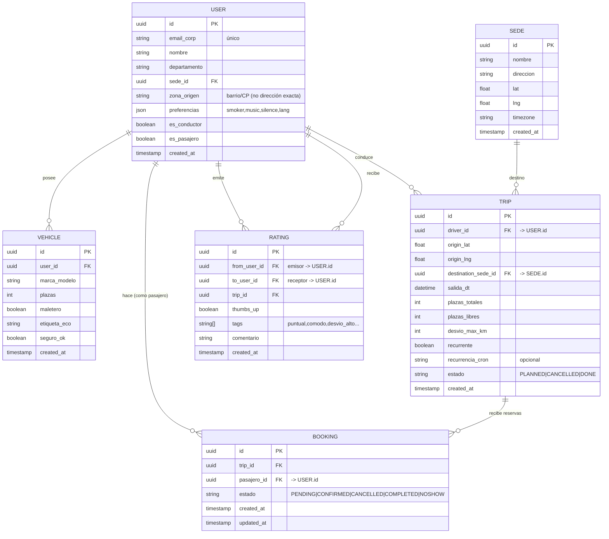

```mermaid
erDiagram
    USER ||--o{ VEHICLE : "posee"
    USER ||--o{ TRIP : "conduce"
    USER ||--o{ BOOKING : "hace (como pasajero)"
    TRIP ||--o{ BOOKING : "recibe reservas"
    SEDE ||--o{ TRIP : "destino"
    USER ||--o{ RATING : "emite"
    USER ||--o{ RATING : "recibe"

    USER {
      uuid id PK
      string email_corp  "único"
      string nombre
      string departamento
      uuid   sede_id FK
      string zona_origen "barrio/CP (no dirección exacta)"
      json   preferencias "smoker,music,silence,lang"
      boolean es_conductor
      boolean es_pasajero
      timestamp created_at
    }

    SEDE {
      uuid  id PK
      string nombre
      string direccion
      float  lat
      float  lng
      string timezone
      timestamp created_at
    }

    VEHICLE {
      uuid  id PK
      uuid  user_id FK
      string marca_modelo
      int    plazas
      boolean maletero
      string etiqueta_eco
      boolean seguro_ok
      timestamp created_at
    }

    TRIP {
      uuid  id PK
      uuid  driver_id FK "-> USER.id"
      float origin_lat
      float origin_lng
      uuid  destination_sede_id FK "-> SEDE.id"
      datetime salida_dt
      int    plazas_totales
      int    plazas_libres
      int    desvio_max_km
      boolean recurrente
      string  recurrencia_cron "opcional"
      string  estado "PLANNED|CANCELLED|DONE"
      timestamp created_at
    }

    BOOKING {
      uuid  id PK
      uuid  trip_id FK
      uuid  pasajero_id FK "-> USER.id"
      string estado "PENDING|CONFIRMED|CANCELLED|COMPLETED|NOSHOW"
      timestamp created_at
      timestamp updated_at
    }

    RATING {
      uuid  id PK
      uuid  from_user_id FK "emisor -> USER.id"
      uuid  to_user_id   FK "receptor -> USER.id"
      uuid  trip_id      FK
      boolean thumbs_up
      string[] tags "puntual,comodo,desvio_alto..."
      string  comentario
      timestamp created_at
    }
```

