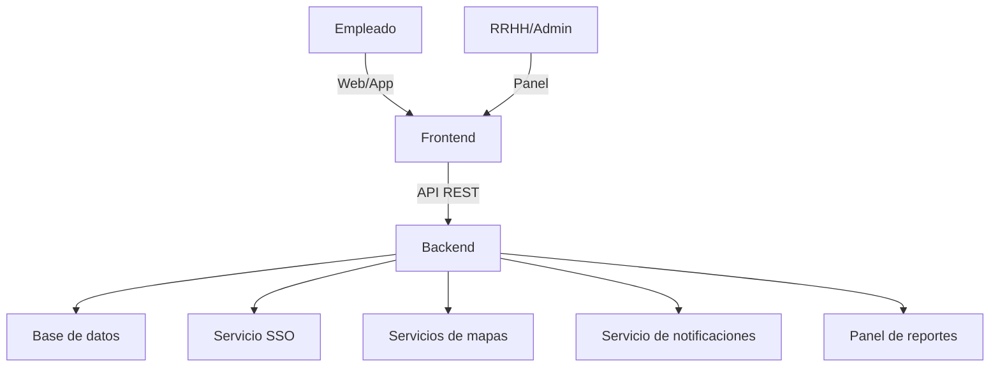

## Índice

0. [Ficha del proyecto](#0-ficha-del-proyecto)
1. [Descripción general del producto](#1-descripción-general-del-producto)
2. [Arquitectura del sistema](#2-arquitectura-del-sistema)
3. [Modelo de datos](#3-modelo-de-datos)
4. [Especificación de la API](#4-especificación-de-la-api)
5. [Historias de usuario](#5-historias-de-usuario)
6. [Tickets de trabajo](#6-tickets-de-trabajo)
7. [Pull requests](#7-pull-requests)

---

## 0. Ficha del proyecto

### **0.1. Tu nombre completo:**

Xavier Vergés Berga

### **0.2. Nombre del proyecto:**

bonÀreaGo

### **0.3. Descripción breve del proyecto:**

Descripción del Proyecto
**bonÀreaGo** es una aplicación interna que permite a los empleados compartir coche de forma segura y sencilla para sus trayectos laborales. El sistema integra autenticación corporativa (SSO), garantiza la privacidad de los datos y se adapta a la cultura y procesos internos de la empresa. Los usuarios pueden publicar trayectos como conductores, buscar y reservar plazas como pasajeros, y recibir notificaciones automáticas de confirmación y recordatorio.

La solución aporta beneficios directos:

- **Reducción de costes** de transporte y parking para empleados y empresa.
- **Disminución de la huella de carbono** y mejora de la ocupación de vehículos.
- **Mejora del bienestar laboral** y la colaboración interna.
- **Control total sobre los datos**, integración con sistemas corporativos y flexibilidad para evolucionar el producto según necesidades futuras.

El MVP propuesto prioriza la adopción rápida y la validación funcional, permitiendo escalar posteriormente con funcionalidades avanzadas (matching inteligente, gamificación, métricas de sostenibilidad, integración con calendario y BI corporativo).

**bonÀreaGo** posiciona a la empresa como referente en movilidad sostenible y bienestar, alineando la iniciativa con los objetivos estratégicos de RSC y eficiencia operativa. La plataforma es fácilmente extensible y puede integrarse con campañas internas, incentivos y reportes personalizados para RRHH y Sostenibilidad.

### **0.4. URL del proyecto:**

> Puede ser pública o privada, en cuyo caso deberás compartir los accesos de manera segura. Puedes enviarlos a [alvaro@lidr.co](mailto:alvaro@lidr.co) usando algún servicio como [onetimesecret](https://onetimesecret.com/).

https://github.com/xavihewel/AI4Devs-finalproject

### 0.5. URL o archivo comprimido del repositorio

> Puedes tenerlo alojado en público o en privado, en cuyo caso deberás compartir los accesos de manera segura. Puedes enviarlos a [alvaro@lidr.co](mailto:alvaro@lidr.co) usando algún servicio como [onetimesecret](https://onetimesecret.com/). También puedes compartir por correo un archivo zip con el contenido

---

## 1. Descripción general del producto

> Describe en detalle los siguientes aspectos del producto:

### **1.1. Objetivo:**

**bonÀreaGo** es una plataforma interna de compartición de viajes corporativos diseñada para facilitar que los empleados compartan coche en sus desplazamientos laborales, tanto recurrentes como puntuales. El objetivo principal es ofrecer una alternativa eficiente, segura y sostenible al transporte individual, reduciendo costes y emisiones, y mejorando la experiencia y el bienestar de los empleados.

La solución aporta valor en varios niveles:

- **Para los empleados**: Ahorro en gastos de transporte y parking, mayor comodidad y oportunidades de networking interno.
- **Para la empresa**: Reducción de la huella de carbono, optimización de recursos, mejora del clima laboral y alineación con los objetivos de sostenibilidad y responsabilidad social corporativa (RSC).
- **Para RRHH y Sostenibilidad**: Herramienta de gestión y reporte sobre movilidad, impacto ambiental y adopción interna.
El producto está pensado para ser fácil de usar, integrarse con los sistemas corporativos existentes y evolucionar según las necesidades de la organización.

### **1.2. Características y funcionalidades principales:**

### 1.2. Características y funcionalidades principales

**bonÀreaGo** incorpora las siguientes características y funcionalidades para satisfacer las necesidades de movilidad corporativa:

1. **Registro e inicio de sesión corporativo**
   - Acceso seguro mediante credenciales de empresa (SSO).
   - Garantiza que solo empleados puedan usar la plataforma.

2. **Gestión de perfil de usuario**
   - Datos básicos, preferencias de viaje y zona de residencia aproximada.
   - Configuración de rol: conductor, pasajero o ambos.

3. **Creación y publicación de trayectos**
   - Permite a los empleados publicar trayectos como conductores o solicitar viajes como pasajeros.
   - Definición de origen, destino, horario y plazas disponibles.

4. **Búsqueda y emparejamiento inteligente**
   - Motor de coincidencias que sugiere viajes compatibles según ruta, horario y preferencias.
   - Filtros por zona, afinidades y horarios.

5. **Reserva y confirmación de plazas**
   - Solicitud y reserva de plaza en un trayecto con confirmación automática o manual.
   - Notificaciones en tiempo real de nuevas coincidencias, confirmaciones y recordatorios.

6. **Mapa y geolocalización básica**
   - Visualización de rutas y puntos de encuentro sugeridos.

7. **Historial de viajes y plantillas**
   - Registro de trayectos realizados y posibilidad de repetir trayectos habituales.

8. **Sistema de reputación y feedback**
   - Valoraciones rápidas entre usuarios y etiquetas de comportamiento.

9. **Privacidad avanzada**
   - Ocultación de datos sensibles, chat interno y control sobre la visibilidad de la información.

10. **Reportes para RRHH y sostenibilidad**
    - Estadísticas de uso, ahorro de CO₂ y métricas de impacto.

11. **Integración con sistemas corporativos**
    - Sincronización con calendario interno y herramientas de RRHH.

12. **Gamificación e incentivos**
    - Rankings, puntos y recompensas para fomentar la adopción.

Estas funcionalidades permiten cubrir tanto los desplazamientos diarios como los puntuales, garantizando una experiencia segura, eficiente y alineada con los objetivos estratégicos de la empresa.

### **1.3. Diseño y experiencia de usuario:**

### 1.3. Diseño y experiencia de usuario

La experiencia de usuario de **bonÀreaGo** está diseñada para ser intuitiva, segura y eficiente, facilitando la adopción por parte de los empleados. El flujo principal incluye:

1. **Pantalla de bienvenida y acceso corporativo**
   - Login mediante credenciales de empresa (SSO).
   - Mensaje de bienvenida y explicación breve del servicio.

2. **Panel principal**
   - Visualización rápida de trayectos disponibles y próximos viajes.
   - Acceso directo a crear un nuevo trayecto como conductor o solicitar uno como pasajero.

3. **Creación de trayecto**
   - Formulario sencillo para definir origen, destino, horario y plazas disponibles.
   - Selección de preferencias (música, fumador/no fumador, etc.).

4. **Búsqueda y emparejamiento**
   - Motor de coincidencias que muestra los viajes compatibles.
   - Filtros por zona, horario y afinidades.

5. **Reserva y confirmación**
   - Solicitud de plaza en un trayecto con confirmación automática o manual.
   - Notificaciones en tiempo real sobre el estado de la reserva.

6. **Mapa y puntos de encuentro**
   - Visualización de rutas y sugerencia de puntos de recogida.

7. **Historial y reputación**
   - Acceso al historial de viajes realizados y valoraciones recibidas.
   - Sistema de feedback rápido entre usuarios.

8. **Privacidad y chat interno**
   - Chat integrado para coordinar detalles del viaje sin compartir datos personales.

9. **Reportes y estadísticas**
   - Panel para consultar métricas personales y corporativas (CO₂ ahorrado, viajes realizados).

### **1.4. Instrucciones de instalación:**
> Documenta de manera precisa las instrucciones para instalar y poner en marcha el proyecto en local (librerías, backend, frontend, servidor, base de datos, migraciones y semillas de datos, etc.)

---

## 2. Arquitectura del Sistema

### **2.1. Diagrama de arquitectura:**
> Usa el formato que consideres más adecuado para representar los componentes principales de la aplicación y las tecnologías utilizadas. Explica si sigue algún patrón predefinido, justifica por qué se ha elegido esta arquitectura, y destaca los beneficios principales que aportan al proyecto y justifican su uso, así como sacrificios o déficits que implica.

La arquitectura de **bonÀreaGo** sigue un enfoque modular basado en el patrón de contenedores, facilitando la escalabilidad, la seguridad y la integración con sistemas corporativos. El sistema se compone de los siguientes elementos principales:

- **Frontend web/app**: Interfaz de usuario accesible desde navegador y dispositivos móviles, desarrollada con tecnologías modernas (React, Vue o similar). Permite a los empleados registrarse, gestionar trayectos, buscar viajes y recibir notificaciones.
- **Backend/API**: Servidor central que gestiona la lógica de negocio, autenticación, emparejamiento de trayectos y comunicación con la base de datos. Implementado en Node.js, Python o similar.
- **Base de datos**: Almacena usuarios, trayectos, reservas, valoraciones y estadísticas. Se recomienda el uso de una base relacional (PostgreSQL, MySQL) por la naturaleza transaccional del sistema.
- **Servicio de autenticación corporativa**: Integración con el sistema de Single Sign-On (SSO) de la empresa para garantizar el acceso seguro y restringido a empleados.
- **Servicios externos**: Integración opcional con mapas (Google Maps, OpenStreetMap) y sistemas de notificaciones (email, push).
- **Panel de administración y reportes**: Acceso para RRHH y responsables de sostenibilidad para consultar métricas y gestionar el sistema.

#### Diagrama de arquitectura (simplificado)

**Justificación y beneficios**

- **Modularidad**: Permite evolucionar cada componente de forma independiente.
- **Seguridad**: El acceso está restringido mediante SSO y la información sensible se gestiona en el backend.
- **Escalabilidad**: La arquitectura soporta crecimiento en número de usuarios y funcionalidades.
- **Integración**: Facilita la conexión con sistemas corporativos y servicios externos.
- **Mantenibilidad**: Separación clara de responsabilidades y facilidad para realizar actualizaciones.

**Sacrificios o déficits**:

- Requiere integración inicial con sistemas corporativos (SSO, mapas).
- La gestión de notificaciones y mapas puede depender de servicios externos.

Esta arquitectura está alineada con las mejores prácticas para aplicaciones corporativas y garantiza una base sólida para el crecimiento futuro del producto.

### **2.2. Descripción de componentes principales:**

> Describe los componentes más importantes, incluyendo la tecnología utilizada

### **2.3. Descripción de alto nivel del proyecto y estructura de ficheros**

> Representa la estructura del proyecto y explica brevemente el propósito de las carpetas principales, así como si obedece a algún patrón o arquitectura específica.

### **2.4. Infraestructura y despliegue**

> Detalla la infraestructura del proyecto, incluyendo un diagrama en el formato que creas conveniente, y explica el proceso de despliegue que se sigue

### **2.5. Seguridad**

> Enumera y describe las prácticas de seguridad principales que se han implementado en el proyecto, añadiendo ejemplos si procede

### **2.6. Tests**

> Describe brevemente algunos de los tests realizados

---

## 3. Modelo de Datos

### **3.1. Diagrama del modelo de datos:**

> Recomendamos usar mermaid para el modelo de datos, y utilizar todos los parámetros que permite la sintaxis para dar el máximo detalle, por ejemplo las claves primarias y foráneas.

erDiagram
    USER {
        int id PK
        string nombre
        string email
        string departamento
        string zona_residencia
        string preferencias_viaje
        string rol
        string foto
        bool activo
    }
    TRAYECTO {
        int id PK
        int conductor_id FK
        string origen
        float origen_latitud
        float origen_longitud
        string destino
        float destino_latitud
        float destino_longitud
        datetime fecha_hora
        int plazas_disponibles
        string estado
        string tipo_trayecto
        string puntos_encuentro
        string notas
    }
    RESERVA {
        int id PK
        int trayecto_id FK
        int pasajero_id FK
        string estado
        datetime fecha_reserva
        bool confirmada
    }
    VALORACION {
        int id PK
        int reserva_id FK
        int evaluador_id FK
        int evaluado_id FK
        int puntuacion
        string comentario
        datetime fecha_valoracion
        string etiquetas
    }
    NOTIFICACION {
        int id PK
        int user_id FK
        string mensaje
        datetime fecha_envio
        bool leida
        string tipo
    }
    CHAT {
        int id PK
        int trayecto_id FK
        int user_id FK
        string mensaje
        datetime fecha_envio
    }
    HISTORIAL {
        int id PK
        int user_id FK
        int trayecto_id FK
        datetime fecha
        string rol
    }
    INCENTIVO {
        int id PK
        int user_id FK
        int puntos
        string tipo
        datetime fecha
        string descripcion
    }
    EVENTO {
        int id PK
        string nombre
        string descripcion
        datetime fecha
        string ubicacion
    }
    TRAYECTO ||--o{ RESERVA : tiene
    USER ||--o{ TRAYECTO : conduce
    USER ||--o{ RESERVA : realiza
    RESERVA ||--o{ VALORACION : genera
    USER ||--o{ VALORACION : evalua
    USER ||--o{ NOTIFICACION : recibe
    TRAYECTO ||--o{ CHAT : tiene
    USER ||--o{ CHAT : escribe
    USER ||--o{ HISTORIAL : registra
    TRAYECTO ||--o{ HISTORIAL : registra
    USER ||--o{ INCENTIVO : obtiene
    EVENTO ||--o{ TRAYECTO : asocia

### **3.2. Descripción de entidades principales:**

> Recuerda incluir el máximo detalle de cada entidad, como el nombre y tipo de cada atributo, descripción breve si procede, claves primarias y foráneas, relaciones y tipo de relación, restricciones (unique, not null…), etc.

---

## 4. Especificación de la API

> Si tu backend se comunica a través de API, describe los endpoints principales (máximo 3) en formato OpenAPI. Opcionalmente puedes añadir un ejemplo de petición y de respuesta para mayor claridad

---

## 5. Historias de Usuario

> Documenta 3 de las historias de usuario principales utilizadas durante el desarrollo, teniendo en cuenta las buenas prácticas de producto al respecto.

Eres un analista de software experto. Enumera y describe brevemente las tres historias de usuario más importantes a implementar para lograr una funcionalidad básica. Usa el template para documentar cada una de estas historias de usuario

**Historia de Usuario 1**

# Historia de Usuario 1: Registro de usuario

**Como** empleado de la empresa  
**Quiero** registrarme en la plataforma bonÀreaGo  
**Para** poder acceder y utilizar el sistema para compartir viajes

## Criterios de aceptación
- El usuario puede crear una cuenta con su correo corporativo.
- El sistema valida que el correo pertenezca a la empresa.
- El usuario recibe confirmación de registro.

**Historia de Usuario 2**

# Historia de Usuario 2: Publicar trayecto como conductor

**Como** empleado registrado  
**Quiero** publicar un trayecto como conductor  
**Para** ofrecer plazas disponibles en mi coche a otros compañeros

## Criterios de aceptación
- El usuario puede indicar origen, destino, fecha, hora y número de plazas.
- El trayecto queda visible para otros usuarios.
- El usuario puede editar o cancelar el trayecto publicado.

**Historia de Usuario 3**

# Historia de Usuario 3: Reservar plaza como pasajero

**Como** empleado registrado  
**Quiero** reservar una plaza en un trayecto publicado  
**Para** compartir viaje con un compañero y llegar juntos al trabajo

## Criterios de aceptación
- El usuario puede ver los trayectos disponibles.
- El usuario puede solicitar una plaza en un trayecto.
- El sistema confirma la reserva y notifica al conductor.

---

## 6. Tickets de Trabajo

> Documenta 3 de los tickets de trabajo principales del desarrollo, uno de backend, uno de frontend, y uno de bases de datos. Da todo el detalle requerido para desarrollar la tarea de inicio a fin teniendo en cuenta las buenas prácticas al respecto. 

**Ticket 1**

**Ticket 2**

**Ticket 3**

---

## 7. Pull Requests

> Documenta 3 de las Pull Requests realizadas durante la ejecución del proyecto

**Pull Request 1**

**Pull Request 2**

**Pull Request 3**

## Registro de Prompts

Consulta `Prompts/prompts_xvb.md` para ver las decisiones y acciones clave documentadas durante el proyecto.

