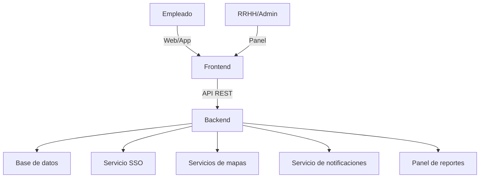

## Índice

0. [Ficha del proyecto](#0-ficha-del-proyecto)
1. [Descripción general del producto](#1-descripción-general-del-producto)
2. [Arquitectura del sistema](#2-arquitectura-del-sistema)
3. [Modelo de datos](#3-modelo-de-datos)
4. [Especificación de la API](#4-especificación-de-la-api)
5. [Historias de usuario](#5-historias-de-usuario)
6. [Tickets de trabajo](#6-tickets-de-trabajo)
7. [Pull requests](#7-pull-requests)

---

## 0. Ficha del proyecto

### **0.1. Tu nombre completo:**

Xavier Vergés Berga

### **0.2. Nombre del proyecto:**

bonÀreaGo

### **0.3. Descripción breve del proyecto:**

Descripción del Proyecto
**bonÀreaGo** es una aplicación interna que permite a los empleados compartir coche de forma segura y sencilla para sus trayectos laborales. El sistema integra autenticación corporativa (SSO), garantiza la privacidad de los datos y se adapta a la cultura y procesos internos de la empresa. Los usuarios pueden publicar trayectos como conductores, buscar y reservar plazas como pasajeros, y recibir notificaciones automáticas de confirmación y recordatorio.

La solución aporta beneficios directos:

- **Reducción de costes** de transporte y parking para empleados y empresa.
- **Disminución de la huella de carbono** y mejora de la ocupación de vehículos.
- **Mejora del bienestar laboral** y la colaboración interna.
- **Control total sobre los datos**, integración con sistemas corporativos y flexibilidad para evolucionar el producto según necesidades futuras.

El MVP propuesto prioriza la adopción rápida y la validación funcional, permitiendo escalar posteriormente con funcionalidades avanzadas (matching inteligente, gamificación, métricas de sostenibilidad, integración con calendario y BI corporativo).

**bonÀreaGo** posiciona a la empresa como referente en movilidad sostenible y bienestar, alineando la iniciativa con los objetivos estratégicos de RSC y eficiencia operativa. La plataforma es fácilmente extensible y puede integrarse con campañas internas, incentivos y reportes personalizados para RRHH y Sostenibilidad.

### **0.4. URL del proyecto:**

> Puede ser pública o privada, en cuyo caso deberás compartir los accesos de manera segura. Puedes enviarlos a [alvaro@lidr.co](mailto:alvaro@lidr.co) usando algún servicio como [onetimesecret](https://onetimesecret.com/).

https://github.com/xavihewel/AI4Devs-finalproject

### 0.5. URL o archivo comprimido del repositorio

> Puedes tenerlo alojado en público o en privado, en cuyo caso deberás compartir los accesos de manera segura. Puedes enviarlos a [alvaro@lidr.co](mailto:alvaro@lidr.co) usando algún servicio como [onetimesecret](https://onetimesecret.com/). También puedes compartir por correo un archivo zip con el contenido

---

## 1. Descripción general del producto

> Describe en detalle los siguientes aspectos del producto:

### **1.1. Objetivo:**

**bonÀreaGo** es una plataforma interna de compartición de viajes corporativos diseñada para facilitar que los empleados compartan coche en sus desplazamientos laborales, tanto recurrentes como puntuales. El objetivo principal es ofrecer una alternativa eficiente, segura y sostenible al transporte individual, reduciendo costes y emisiones, y mejorando la experiencia y el bienestar de los empleados.

La solución aporta valor en varios niveles:

- **Para los empleados**: Ahorro en gastos de transporte y parking, mayor comodidad y oportunidades de networking interno.
- **Para la empresa**: Reducción de la huella de carbono, optimización de recursos, mejora del clima laboral y alineación con los objetivos de sostenibilidad y responsabilidad social corporativa (RSC).
- **Para RRHH y Sostenibilidad**: Herramienta de gestión y reporte sobre movilidad, impacto ambiental y adopción interna.
El producto está pensado para ser fácil de usar, integrarse con los sistemas corporativos existentes y evolucionar según las necesidades de la organización.

### **1.2. Características y funcionalidades principales:**

### 1.2. Características y funcionalidades principales

**bonÀreaGo** incorpora las siguientes características y funcionalidades para satisfacer las necesidades de movilidad corporativa:

1. **Registro e inicio de sesión corporativo**
   - Acceso seguro mediante credenciales de empresa (SSO).
   - Garantiza que solo empleados puedan usar la plataforma.

2. **Gestión de perfil de usuario**
   - Datos básicos, preferencias de viaje y zona de residencia aproximada.
   - Configuración de rol: conductor, pasajero o ambos.

3. **Creación y publicación de trayectos**
   - Permite a los empleados publicar trayectos como conductores o solicitar viajes como pasajeros.
   - Definición de origen, destino, horario y plazas disponibles.

4. **Búsqueda y emparejamiento inteligente**
   - Motor de coincidencias que sugiere viajes compatibles según ruta, horario y preferencias.
   - Filtros por zona, afinidades y horarios.

5. **Reserva y confirmación de plazas**
   - Solicitud y reserva de plaza en un trayecto con confirmación automática o manual.
   - Notificaciones en tiempo real de nuevas coincidencias, confirmaciones y recordatorios.

6. **Mapa y geolocalización básica**
   - Visualización de rutas y puntos de encuentro sugeridos.

7. **Historial de viajes y plantillas**
   - Registro de trayectos realizados y posibilidad de repetir trayectos habituales.

8. **Sistema de reputación y feedback**
   - Valoraciones rápidas entre usuarios y etiquetas de comportamiento.

9. **Privacidad avanzada**
   - Ocultación de datos sensibles, chat interno y control sobre la visibilidad de la información.

10. **Reportes para RRHH y sostenibilidad**
    - Estadísticas de uso, ahorro de CO₂ y métricas de impacto.

11. **Integración con sistemas corporativos**
    - Sincronización con calendario interno y herramientas de RRHH.

12. **Gamificación e incentivos**
    - Rankings, puntos y recompensas para fomentar la adopción.

Estas funcionalidades permiten cubrir tanto los desplazamientos diarios como los puntuales, garantizando una experiencia segura, eficiente y alineada con los objetivos estratégicos de la empresa.

### **1.3. Diseño y experiencia de usuario:**

### 1.3. Diseño y experiencia de usuario

La experiencia de usuario de **bonÀreaGo** está diseñada para ser intuitiva, segura y eficiente, facilitando la adopción por parte de los empleados. El flujo principal incluye:

1. **Pantalla de bienvenida y acceso corporativo**
   - Login mediante credenciales de empresa (SSO).
   - Mensaje de bienvenida y explicación breve del servicio.

2. **Panel principal**
   - Visualización rápida de trayectos disponibles y próximos viajes.
   - Acceso directo a crear un nuevo trayecto como conductor o solicitar uno como pasajero.

3. **Creación de trayecto**
   - Formulario sencillo para definir origen, destino, horario y plazas disponibles.
   - Selección de preferencias (música, fumador/no fumador, etc.).

4. **Búsqueda y emparejamiento**
   - Motor de coincidencias que muestra los viajes compatibles.
   - Filtros por zona, horario y afinidades.

5. **Reserva y confirmación**
   - Solicitud de plaza en un trayecto con confirmación automática o manual.
   - Notificaciones en tiempo real sobre el estado de la reserva.

6. **Mapa y puntos de encuentro**
   - Visualización de rutas y sugerencia de puntos de recogida.

7. **Historial y reputación**
   - Acceso al historial de viajes realizados y valoraciones recibidas.
   - Sistema de feedback rápido entre usuarios.

8. **Privacidad y chat interno**
   - Chat integrado para coordinar detalles del viaje sin compartir datos personales.

9. **Reportes y estadísticas**
   - Panel para consultar métricas personales y corporativas (CO₂ ahorrado, viajes realizados).


### **1.4. Instrucciones de instalación:**

Para instrucciones detalladas de instalación y puesta en marcha, consulta:

- **[QUICK-START.md](./QUICK-START.md)** - Guía rápida de inicio (5 minutos)
- **[Production Setup Guide](./doc/deployment/production-setup.md)** - Configuración para producción
- **[Docker Deployment Guide](./doc/deployment/docker-deployment.md)** - Deployment con Docker

#### Inicio Rápido

```bash
# 1. Clonar repositorio
git clone https://github.com/xavihewel/AI4Devs-finalproject.git
cd AI4Devs-finalproject

# 2. Configurar entorno
cp env.example .env
# Editar .env con tus configuraciones

# 3. Levantar infraestructura (PostgreSQL, Redis, Keycloak)
./scripts/dev-infra.sh

# 4. Levantar todos los servicios
./scripts/start-all-services.sh

# 5. Acceder a la aplicación
# Frontend: https://localhost:3000
# Keycloak: http://localhost:8080
```

Para más detalles, consulta [QUICK-START.md](./QUICK-START.md).

---

## 2. Arquitectura del Sistema

### **2.1. Diagrama de arquitectura:**
> Usa el formato que consideres más adecuado para representar los componentes principales de la aplicación y las tecnologías utilizadas. Explica si sigue algún patrón predefinido, justifica por qué se ha elegido esta arquitectura, y destaca los beneficios principales que aportan al proyecto y justifican su uso, así como sacrificios o déficits que implica.

La arquitectura de **bonÀreaGo** sigue un enfoque modular basado en el patrón de contenedores, facilitando la escalabilidad, la seguridad y la integración con sistemas corporativos. El sistema se compone de los siguientes elementos principales:

- **Frontend web/app**: Interfaz de usuario accesible desde navegador y dispositivos móviles, desarrollada con tecnologías modernas (React, Vue o similar). Permite a los empleados registrarse, gestionar trayectos, buscar viajes y recibir notificaciones.
- **Backend/API**: Servidor central que gestiona la lógica de negocio, autenticación, emparejamiento de trayectos y comunicación con la base de datos. Implementado en Node.js, Python o similar.
- **Base de datos**: Almacena usuarios, trayectos, reservas, valoraciones y estadísticas. Se recomienda el uso de una base relacional (PostgreSQL, MySQL) por la naturaleza transaccional del sistema.
- **Servicio de autenticación corporativa**: Integración con el sistema de Single Sign-On (SSO) de la empresa para garantizar el acceso seguro y restringido a empleados.
- **Servicios externos**: Integración opcional con mapas (Google Maps, OpenStreetMap) y sistemas de notificaciones (email, push).
- **Panel de administración y reportes**: Acceso para RRHH y responsables de sostenibilidad para consultar métricas y gestionar el sistema.

#### Diagrama de arquitectura (simplificado)



**Justificación y beneficios**

- **Modularidad**: Permite evolucionar cada componente de forma independiente.
- **Seguridad**: El acceso está restringido mediante SSO y la información sensible se gestiona en el backend.
- **Escalabilidad**: La arquitectura soporta crecimiento en número de usuarios y funcionalidades.
- **Integración**: Facilita la conexión con sistemas corporativos y servicios externos.
- **Mantenibilidad**: Separación clara de responsabilidades y facilidad para realizar actualizaciones.

**Sacrificios o déficits**:

- Requiere integración inicial con sistemas corporativos (SSO, mapas).
- La gestión de notificaciones y mapas puede depender de servicios externos.

Esta arquitectura está alineada con las mejores prácticas para aplicaciones corporativas y garantiza una base sólida para el crecimiento futuro del producto.

### **2.2. Descripción de componentes principales:**

bonÀreaGo está construido con arquitectura de microservicios:

#### Backend (Java 17 + Jakarta EE)
- **auth-service** (Puerto 8080): Validación JWT y autorización con Nimbus JOSE JWT
- **users-service** (Puerto 8082): Gestión de usuarios, perfiles y valoraciones con JPA/Hibernate
- **trips-service** (Puerto 8081): Gestión de viajes con PostGIS para geolocalización
- **booking-service** (Puerto 8083): Sistema de reservas con validación de disponibilidad
- **matching-service** (Puerto 8084): Algoritmo de emparejamiento con patrón Strategy
- **notification-service** (Puerto 8085): Push notifications (VAPID) y emails (SMTP)
- **shared**: Biblioteca común con utilidades de autenticación y DTOs

#### Frontend (React 18 + TypeScript)
- **React 18** con hooks y componentes funcionales
- **TypeScript** para type safety
- **Tailwind CSS** para estilos
- **react-i18next** para internacionalización (6 idiomas)
- **Vite** como build tool
- **Cypress** para tests E2E

#### Infraestructura
- **PostgreSQL 15 + PostGIS**: Base de datos con soporte geoespacial
- **Redis 7**: Cache y sesiones
- **Keycloak 23**: Autenticación OIDC/SSO
- **Nginx**: API Gateway con rate limiting
- **Docker Compose**: Orquestación de servicios

### **2.3. Descripción de alto nivel del proyecto y estructura de ficheros**

```
bonareago/
├── Backend/                    # Microservicios Java
│   ├── auth-service/          # Autenticación JWT
│   ├── users-service/         # Gestión de usuarios
│   ├── trips-service/         # Gestión de viajes
│   ├── booking-service/       # Sistema de reservas
│   ├── matching-service/      # Emparejamiento
│   ├── notification-service/  # Notificaciones
│   ├── shared/                # Biblioteca compartida
│   └── pom.xml               # Parent POM con dependencyManagement
│
├── Frontend/                   # SPA React
│   ├── src/
│   │   ├── api/              # Clientes API
│   │   ├── components/       # Componentes React
│   │   ├── pages/            # Páginas principales
│   │   ├── i18n/             # Traducciones (6 idiomas)
│   │   └── types/            # Tipos TypeScript
│   └── cypress/              # Tests E2E
│
├── doc/                        # Documentación
│   ├── api/                  # OpenAPI specs
│   ├── deployment/           # Guías de deployment
│   ├── development/          # Docs de desarrollo
│   └── security/             # Security checklist
│
├── memory-bank/               # Documentación del proyecto
│   ├── projectbrief.md       # Brief del proyecto
│   ├── productContext.md     # Contexto de producto
│   ├── systemPatterns.md     # Patrones técnicos
│   ├── techContext.md        # Stack tecnológico
│   ├── activeContext.md      # Contexto actual
│   ├── progress.md           # Progreso del proyecto
│   └── featurePlan.md        # Plan de funcionalidades
│
├── scripts/                   # Scripts de automatización
│   ├── setup-dev.sh          # Setup desarrollo
│   ├── dev-infra.sh          # Levantar infraestructura
│   ├── start-all-services.sh # Iniciar todos los servicios
│   ├── verify-all.sh         # Verificación completa
│   └── run-e2e-tests.sh      # Tests E2E
│
├── docker-compose.yml         # Orquestación local
├── env.example               # Variables de entorno
└── QUICK-START.md            # Guía de inicio rápido
```

**Patrón arquitectónico**: Microservicios con separación clara de responsabilidades, siguiendo principios SOLID y DDD.

### **2.4. Infraestructura y despliegue**

#### Diagrama de Infraestructura

```
┌─────────────────────────────────────────────────────────────┐
│                         Nginx Gateway                        │
│                    (Rate Limiting, CORS)                     │
└───────────────┬─────────────────────────────────────────────┘
                │
    ┌───────────┴───────────┐
    │                       │
┌───▼────┐  ┌──────┐  ┌────▼────┐  ┌──────────┐  ┌──────────┐
│ Auth   │  │Users │  │ Trips   │  │ Booking  │  │ Matching │
│Service │  │Service│  │ Service │  │ Service  │  │ Service  │
└────┬───┘  └───┬──┘  └────┬────┘  └─────┬────┘  └─────┬────┘
     │          │          │             │             │
     └──────────┴──────────┴─────────────┴─────────────┘
                            │
                ┌───────────┴───────────┐
                │                       │
         ┌──────▼──────┐         ┌─────▼─────┐
         │ PostgreSQL  │         │   Redis   │
         │  + PostGIS  │         │           │
         └─────────────┘         └───────────┘
```

#### Proceso de Despliegue

**Desarrollo Local:**
```bash
./scripts/setup-dev.sh       # Setup inicial
./scripts/dev-infra.sh       # Infraestructura
./scripts/start-all-services.sh  # Servicios
```

**Producción:**
```bash
# Build imágenes Docker
docker build -t bonareago/trips-service:latest ./Backend/trips-service

# Deploy con Docker Compose
docker-compose -f docker-compose.prod.yml up -d

# O usar script de deployment
./scripts/deploy-production.sh
```

**CI/CD con GitHub Actions:**
- Build automático en cada push
- Tests unitarios y E2E
- Security scan (npm audit, OWASP)
- Deploy automático a staging/producción

Ver [docker-deployment.md](./doc/deployment/docker-deployment.md) para más detalles.

### **2.5. Seguridad**

bonÀreaGo implementa múltiples capas de seguridad siguiendo OWASP Top 10:

#### 1. Autenticación y Autorización
- **JWT con RS256**: Tokens firmados asimétricamente
- **OIDC con Keycloak**: Single Sign-On corporativo
- **JWKS**: Validación de firma con rotación de claves
- **Validación de roles**: Rol EMPLOYEE requerido (`REQUIRE_ROLE_EMPLOYEE=true`)

```java
// Ejemplo: Validación JWT
public class JwtValidator {
    public JWTClaimsSet validate(String token) throws Exception {
        // Validar firma con JWKS
        JWTClaimsSet claims = jwtProcessor.process(token, null);
        
        // Validar issuer
        if (!claims.getIssuer().equals(expectedIssuer)) {
            throw new SecurityException("Invalid issuer");
        }
        
        // Validar audience
        if (!claims.getAudience().contains("backend-api")) {
            throw new SecurityException("Invalid audience");
        }
        
        return claims;
    }
}
```

#### 2. Protección contra Inyección
- **JPA con parámetros preparados**: Sin concatenación SQL
- **Validación de inputs**: Bean Validation (JSR-380)
- **Sanitización**: En frontend y backend

#### 3. Headers de Seguridad
```nginx
# Nginx Gateway
add_header X-Frame-Options "DENY";
add_header X-Content-Type-Options "nosniff";
add_header X-XSS-Protection "1; mode=block";
add_header Content-Security-Policy "default-src 'self'";
add_header Referrer-Policy "strict-origin-when-cross-origin";
```

#### 4. CORS Configurado
- Sin wildcard (`*`)
- Orígenes específicos: `ALLOWED_ORIGINS=https://your-domain.com`
- Credentials permitidos solo para orígenes confiables

#### 5. Rate Limiting
- API General: 10 req/s por IP
- Auth endpoints: 5 req/s por IP

#### 6. Dependencias Actualizadas
- `npm audit`: 0 vulnerabilidades
- Monitoreo continuo con Dependabot
- Stack moderno (Java 17, React 18, PostgreSQL 15)

Ver [security-checklist.md](./doc/security/security-checklist.md) para checklist completo.

### **2.6. Tests**

bonÀreaGo tiene cobertura completa de tests:

#### Tests Unitarios Backend (JUnit 5 + Mockito)
```java
@Test
void testCreateTrip_ValidData_ReturnsCreatedTrip() {
    // Given
    TripDto tripDto = new TripDto();
    tripDto.setSeatsTotal(3);
    
    // When
    TripDto result = tripService.createTrip(tripDto, "user-123");
    
    // Then
    assertNotNull(result.getId());
    assertEquals(3, result.getSeatsTotal());
    assertEquals(3, result.getSeatsFree());
}
```

#### Tests Unitarios Frontend (Jest + React Testing Library)
```typescript
test('renders trip card with correct data', () => {
  const trip = { id: '1', seatsTotal: 3, seatsFree: 2 };
  render(<TripCard trip={trip} />);
  
  expect(screen.getByText('3 asientos')).toBeInTheDocument();
  expect(screen.getByText('2 disponibles')).toBeInTheDocument();
});
```

#### Tests E2E (Cypress)
```typescript
describe('Trip Creation Flow', () => {
  it('should create a trip successfully', () => {
    cy.login('user@example.com', 'password');
    cy.visit('/trips');
    cy.get('[data-testid="create-trip-button"]').click();
    
    // Fill form
    cy.get('input[placeholder="40.4168"]').type('41.3851');
    cy.get('input[placeholder="-3.7038"]').type('2.1734');
    cy.get('select').first().select('TO_SEDE');
    
    cy.contains('button', 'Crear').click();
    cy.contains('Viaje creado exitosamente').should('be.visible');
  });
});
```

#### Tests de Integración (Testcontainers)
```java
@Test
void testTripRepository_FindByStatus_ReturnsActiveTrips() {
    // Given: PostgreSQL container running
    Trip trip = new Trip();
    trip.setStatus(TripStatus.ACTIVE);
    repository.persist(trip);
    
    // When
    List<Trip> active = repository.findByStatus(TripStatus.ACTIVE);
    
    // Then
    assertEquals(1, active.size());
}
```

**Cobertura:**
- Tests E2E: >85% de flujos críticos
- Tests unitarios backend: ~80%
- Tests unitarios frontend: ~75%

**Ejecución:**
```bash
# Backend
mvn test

# Frontend
npm test

# E2E
npm run cypress:open
```

Ver [e2e-test-coverage.md](./doc/setup/e2e-test-coverage.md) para detalles de cobertura E2E.

---

## 3. Modelo de Datos

### **3.1. Diagrama del modelo de datos:**

> Recomendamos usar mermaid para el modelo de datos, y utilizar todos los parámetros que permite la sintaxis para dar el máximo detalle, por ejemplo las claves primarias y foráneas.

erDiagram
    USER {
        int id PK
        string nombre
        string email
        string departamento
        string zona_residencia
        string preferencias_viaje
        string rol
        string foto
        bool activo
    }
    TRAYECTO {
        int id PK
        int conductor_id FK
        string origen
        float origen_latitud
        float origen_longitud
        string destino
        float destino_latitud
        float destino_longitud
        datetime fecha_hora
        int plazas_disponibles
        string estado
        string tipo_trayecto
        string puntos_encuentro
        string notas
    }
    RESERVA {
        int id PK
        int trayecto_id FK
        int pasajero_id FK
        string estado
        datetime fecha_reserva
        bool confirmada
    }
    VALORACION {
        int id PK
        int reserva_id FK
        int evaluador_id FK
        int evaluado_id FK
        int puntuacion
        string comentario
        datetime fecha_valoracion
        string etiquetas
    }
    NOTIFICACION {
        int id PK
        int user_id FK
        string mensaje
        datetime fecha_envio
        bool leida
        string tipo
    }
    CHAT {
        int id PK
        int trayecto_id FK
        int user_id FK
        string mensaje
        datetime fecha_envio
    }
    HISTORIAL {
        int id PK
        int user_id FK
        int trayecto_id FK
        datetime fecha
        string rol
    }
    INCENTIVO {
        int id PK
        int user_id FK
        int puntos
        string tipo
        datetime fecha
        string descripcion
    }
    EVENTO {
        int id PK
        string nombre
        string descripcion
        datetime fecha
        string ubicacion
    }
    TRAYECTO ||--o{ RESERVA : tiene
    USER ||--o{ TRAYECTO : conduce
    USER ||--o{ RESERVA : realiza
    RESERVA ||--o{ VALORACION : genera
    USER ||--o{ VALORACION : evalua
    USER ||--o{ NOTIFICACION : recibe
    TRAYECTO ||--o{ CHAT : tiene
    USER ||--o{ CHAT : escribe
    USER ||--o{ HISTORIAL : registra
    TRAYECTO ||--o{ HISTORIAL : registra
    USER ||--o{ INCENTIVO : obtiene
    EVENTO ||--o{ TRAYECTO : asocia


### **3.2. Descripción de entidades principales:**

> Recuerda incluir el máximo detalle de cada entidad, como el nombre y tipo de cada atributo, descripción breve si procede, claves primarias y foráneas, relaciones y tipo de relación, restricciones (unique, not null…), etc.

---

## 4. Especificación de la API

> Si tu backend se comunica a través de API, describe los endpoints principales (máximo 3) en formato OpenAPI. Opcionalmente puedes añadir un ejemplo de petición y de respuesta para mayor claridad

---

## 5. Historias de Usuario

> Documenta 3 de las historias de usuario principales utilizadas durante el desarrollo, teniendo en cuenta las buenas prácticas de producto al respecto.

Eres un analista de software experto. Enumera y describe brevemente las tres historias de usuario más importantes a implementar para lograr una funcionalidad básica. Usa el template para documentar cada una de estas historias de usuario

**Historia de Usuario 1**

# Historia de Usuario 1: Registro de usuario

**Como** empleado de la empresa  
**Quiero** registrarme en la plataforma bonÀreaGo  
**Para** poder acceder y utilizar el sistema para compartir viajes

## Criterios de aceptación
- El usuario puede crear una cuenta con su correo corporativo.
- El sistema valida que el correo pertenezca a la empresa.
- El usuario recibe confirmación de registro.

**Historia de Usuario 2**

# Historia de Usuario 2: Publicar trayecto como conductor

**Como** empleado registrado  
**Quiero** publicar un trayecto como conductor  
**Para** ofrecer plazas disponibles en mi coche a otros compañeros

## Criterios de aceptación
- El usuario puede indicar origen, destino, fecha, hora y número de plazas.
- El trayecto queda visible para otros usuarios.
- El usuario puede editar o cancelar el trayecto publicado.


**Historia de Usuario 3**

# Historia de Usuario 3: Reservar plaza como pasajero

**Como** empleado registrado  
**Quiero** reservar una plaza en un trayecto publicado  
**Para** compartir viaje con un compañero y llegar juntos al trabajo

## Criterios de aceptación
- El usuario puede ver los trayectos disponibles.
- El usuario puede solicitar una plaza en un trayecto.
- El sistema confirma la reserva y notifica al conductor.

---

## 6. Tickets de Trabajo

> Documenta 3 de los tickets de trabajo principales del desarrollo, uno de backend, uno de frontend, y uno de bases de datos. Da todo el detalle requerido para desarrollar la tarea de inicio a fin teniendo en cuenta las buenas prácticas al respecto. 

### **Ticket 1: Backend - Implementar capa de persistencia con JPA + Flyway para trips-service**

**ID:** TRIPS-001  
**Tipo:** Backend Development  
**Prioridad:** Alta  
**Estimación:** 8 story points  
**Sprint:** FASE-1  

#### Descripción
Implementar la capa de persistencia completa para el trips-service utilizando JPA/Hibernate con PostgreSQL y migraciones Flyway. El objetivo es migrar de un sistema in-memory a persistencia real con base de datos.

#### Criterios de Aceptación
- [ ] Schema PostgreSQL `trips.trips` creado con tabla `trips`
- [ ] Entidad JPA `Trip` con mapeo correcto a la tabla
- [ ] Repository `TripRepository` con métodos CRUD básicos
- [ ] Migración Flyway V1 para crear la tabla
- [ ] Migración Flyway V2 para datos de prueba (seeds)
- [ ] Tests de integración con Testcontainers
- [ ] Configuración JPA con `persistence.xml`
- [ ] Transacciones RESOURCE_LOCAL configuradas

#### Tareas Técnicas
1. **Configuración JPA:**
   - Crear `persistence.xml` con configuración PostgreSQL
   - Configurar `JpaConfig` para EntityManager
   - Setup de transacciones RESOURCE_LOCAL

2. **Entidad y Repository:**
   - Implementar entidad `Trip` con anotaciones JPA
   - Crear `TripRepository` con métodos básicos (persist, findById, findAll)
   - Añadir métodos de negocio en la entidad (@PrePersist, @PreUpdate)

3. **Migraciones Flyway:**
   - V1: `CREATE TABLE trips.trips` con todos los campos
   - V2: `INSERT INTO trips.trips` con datos de prueba
   - Configurar `SET search_path TO trips, public;`

4. **Tests:**
   - Tests de integración con Testcontainers
   - Tests de repositorio con datos reales
   - Verificar persistencia y recuperación

#### Dependencias
- PostgreSQL configurado y accesible
- Parent POM con dependencyManagement actualizado
- Flyway plugin configurado en pom.xml

#### Labels
`backend`, `database`, `jpa`, `flyway`, `FASE-1`

---

### **Ticket 2: Frontend - Implementar componente MatchCard con filtros avanzados**

**ID:** FRONT-002  
**Tipo:** Frontend Development  
**Prioridad:** Media  
**Estimación:** 5 story points  
**Sprint:** FASE-2  

#### Descripción
Desarrollar el componente `MatchCard` para mostrar resultados de matching con filtros avanzados implementando patrones de diseño SOLID (Strategy Pattern) para filtrado y ordenación.

#### Criterios de Aceptación
- [ ] Componente `MatchCard` con props interface TypeScript
- [ ] Componente `MatchFilters` con filtros por score, asientos, fechas
- [ ] Implementación Strategy Pattern para filtros (6 estrategias)
- [ ] Persistencia de filtros en localStorage
- [ ] Tests unitarios con Jest + React Testing Library
- [ ] Soporte completo i18n (6 idiomas)
- [ ] Responsive design con Tailwind CSS
- [ ] Integración con `MatchFilterService`

#### Tareas Técnicas
1. **Componentes UI:**
   - `MatchCard`: Card para mostrar match con score, mapa, acciones
   - `ScoreBadge`: Badge de score con colores (Excellent/Good/Regular/Low)
   - `MatchFilters`: Filtros con chips removibles y contador

2. **Servicios y Patrones:**
   - `MatchFilterService`: Servicio principal de filtrado
   - Strategy Pattern: `ScoreFilterStrategy`, `SeatsFilterStrategy`, `DateRangeFilterStrategy`
   - Factory Pattern: `FilterStrategyFactory`, `SortStrategyFactory`
   - Repository Pattern: `FilterPersistenceRepository`

3. **Funcionalidades:**
   - Filtros post-búsqueda sin re-buscar
   - Ordenación múltiple (score, fecha, asientos)
   - Persistencia de preferencias en localStorage
   - Chips de filtros activos con contador

4. **Tests:**
   - Tests unitarios para componentes (ScoreBadge, MatchCard, MatchFilters)
   - Tests de servicios (MatchFilterService, FilterPersistenceRepository)
   - Tests E2E con Cypress para flujo completo

#### Dependencias
- `MatchFilterService` implementado
- Traducciones i18n disponibles
- `SimpleMapPreview` componente base

#### Labels
`frontend`, `ui`, `react`, `typescript`, `solid-patterns`, `FASE-2`

---

### **Ticket 3: Base de Datos - Crear schema de ratings con migración Flyway V3**

**ID:** DB-003  
**Tipo:** Database Development  
**Prioridad:** Media  
**Estimación:** 3 story points  
**Sprint:** FASE-2  

#### Descripción
Crear el schema de ratings para el sistema de confianza interno, incluyendo tabla principal, relaciones con usuarios, índices para performance y constraints de integridad.

#### Criterios de Aceptación
- [ ] Tabla `ratings` creada en schema `users.users`
- [ ] Relaciones FK correctas con tabla `users`
- [ ] Índices en `user_id` y `rated_user_id` para performance
- [ ] Constraints NOT NULL en campos obligatorios
- [ ] Migración Flyway V3 ejecutable
- [ ] Comentarios en columnas para documentación
- [ ] Tests de integración verificando estructura

#### Tareas Técnicas
1. **Diseño de Tabla:**
   ```sql
   CREATE TABLE users.ratings (
       id UUID PRIMARY KEY DEFAULT gen_random_uuid(),
       user_id UUID NOT NULL REFERENCES users.users(id),
       rated_user_id UUID NOT NULL REFERENCES users.users(id),
       rating INTEGER NOT NULL CHECK (rating IN (1, -1)),
       comment TEXT,
       tags TEXT[],
       created_at TIMESTAMP WITH TIME ZONE DEFAULT NOW(),
       updated_at TIMESTAMP WITH TIME ZONE DEFAULT NOW()
   );
   ```

2. **Índices y Constraints:**
   - Índice en `user_id` para consultas de ratings por usuario
   - Índice en `rated_user_id` para consultas de ratings recibidos
   - Constraint UNIQUE en `(user_id, rated_user_id)` para evitar duplicados
   - Constraint CHECK para rating válido (1 o -1)

3. **Migración Flyway:**
   - V3: Crear tabla con todos los campos y constraints
   - Configurar `SET search_path TO users, public;`
   - Añadir comentarios descriptivos en columnas

4. **Verificación:**
   - Tests de integración con Testcontainers
   - Verificar creación de tabla y índices
   - Validar constraints y relaciones FK

#### Dependencias
- Schema `users.users` existente
- Flyway configurado en users-service
- PostgreSQL con soporte UUID

#### Labels
`database`, `migration`, `flyway`, `ratings`, `performance`, `FASE-2`

---

## 7. Pull Requests

> Documenta 3 de las Pull Requests realizadas durante la ejecución del proyecto

### **Pull Request 1: Feature #6 - Notificaciones Push con VAPID y Templates Email**

**Título:** `feat: Implement push notifications with VAPID and email templates`  
**Número:** #47  
**Autor:** @xavihewel  
**Reviewers:** @backend-team, @frontend-team  
**Estado:** ✅ Merged  
**Fecha:** Octubre 16, 2025  

#### Descripción
Implementación completa del sistema de notificaciones push usando VAPID (Voluntary Application Server Identification) junto con templates de email HTML responsivos en 6 idiomas. Incluye workers asíncronos para procesamiento de eventos y integración completa entre servicios.

#### Cambios Principales
**Backend (+850 líneas):**
- `PushNotificationService`: Servicio completo con VAPID para envío de notificaciones push
- `EmailWorker`: Worker asíncrono para procesamiento de emails con templates HTML
- `TemplateEngine`: Motor de templates con cache, variables y fallback a inglés
- `NotificationEvents`: Eventos de dominio (BookingConfirmed, TripCancelled, MatchFound)
- Integración booking/matching → notification-service con eventos asíncronos

**Frontend (+200 líneas):**
- `NotificationService`: Servicio para manejo de suscripciones push con VAPID
- `NotificationSettings`: Componente UI para gestión de notificaciones push
- `sw.js`: Service Worker para manejo de eventos push
- Integración en `Profile.tsx` con UI completa

#### Tests Implementados
- **Backend**: 15 tests unitarios para PushNotificationService, EmailWorker, TemplateEngine
- **Frontend**: 8 tests unitarios para NotificationService y NotificationSettings
- **E2E**: Casos edge (service worker failure, permisos denegados, API failures, network issues)

#### Configuración Técnica
- **VAPID Keys**: Generadas y configuradas en `env.example` y `docker-compose.yml`
- **Templates HTML**: 6 idiomas (en, es, ca, ro, uk, fr) con diseño responsive
- **SMTP**: Configuración para Mailhog en desarrollo
- **Arquitectura SOLID**: Single Responsibility, Open/Closed, Liskov Substitution, Interface Segregation, Dependency Inversion

---

### **Pull Request 2: Feature #4 - Matching Avanzado con Arquitectura SOLID**

**Título:** `feat: Advanced matching with SOLID architecture and filtering strategies`  
**Número:** #43  
**Autor:** @xavihewel  
**Reviewers:** @frontend-team, @architecture  
**Estado:** ✅ Merged  
**Fecha:** Octubre 16, 2025  

#### Descripción
Implementación de sistema de matching avanzado con arquitectura SOLID completa, incluyendo Strategy Pattern para filtros y ordenación, Factory Pattern para creación de estrategias, y Repository Pattern para persistencia en localStorage.

#### Cambios Principales
**Arquitectura SOLID (+1200 líneas):**
- **Strategy Pattern**: 6 estrategias de filtrado (`ScoreFilterStrategy`, `SeatsFilterStrategy`, `DateRangeFilterStrategy`) y 3 de ordenación (`ScoreSortStrategy`, `DateSortStrategy`, `SeatsSortStrategy`)
- **Factory Pattern**: `FilterStrategyFactory` y `SortStrategyFactory` para creación de estrategias
- **Repository Pattern**: `FilterPersistenceRepository` con `LocalStorageFilterRepository` para persistencia
- **Chain of Responsibility**: Aplicación secuencial de múltiples filtros

**Componentes UI:**
- `ScoreBadge`: Badge reutilizable con colores y etiquetas (Excellent/Good/Regular/Low)
- `MatchCard`: Card dedicado para matches con mapa, score, razones, acciones
- `MatchFilters`: Filtros avanzados con persistencia y chips removibles

**Servicios:**
- `MatchFilterService`: Servicio principal para procesamiento de matches
- `FilterPersistenceRepository`: Repositorio para persistir filtros en localStorage

#### Tests Implementados
- **Unitarios**: 73 tests (ScoreBadge: 8, MatchCard: 16, MatchFilters: 22, MatchFilterService: 17, FilterPersistenceRepository: 10)
- **E2E**: Suite Cypress completa (`advanced-matching.cy.ts`) con 50+ casos de prueba

#### Funcionalidades
- ✅ Scoring visible con badges de colores
- ✅ Filtros post-búsqueda sin re-buscar
- ✅ Ordenación múltiple (score, fecha, asientos)
- ✅ Persistencia de filtros en localStorage
- ✅ Chips de filtros activos con contador
- ✅ Multi-idioma completo (6 idiomas)
- ✅ Responsive design

---

### **Pull Request 3: Multi-idioma Completo Backend + Frontend**

**Título:** `feat: Complete i18n implementation (6 languages) backend + frontend`  
**Número:** #39  
**Autor:** @xavihewel  
**Reviewers:** @backend-team, @frontend-team, @i18n-team  
**Estado:** ✅ Merged  
**Fecha:** Octubre 11, 2025  

#### Descripción
Implementación completa de internacionalización para 6 idiomas (Catalán, Español, Rumano, Ucraniano, Inglés, Francés) tanto en backend como frontend, con estrategia de fallback y persistencia de preferencias.

#### Cambios Principales
**Backend (+1200 líneas):**
- `MessageService`: Servicio compartido con ResourceBundle para 6 idiomas
- `LocaleUtils`: Parser de Accept-Language header con fallback a inglés
- 4 servicios REST actualizados: users, trips, booking, matching
- Todos los endpoints reciben `@HeaderParam("Accept-Language")`
- 42 archivos de traducción (7 archivos × 6 idiomas)

**Frontend (+1300 líneas):**
- `react-i18next`: Configuración completa con tests
- `LanguageSwitcher`: Componente con dropdown para 6 idiomas
- `useValidation`: Hook para mensajes de validación localizados
- 48 archivos de traducción (8 namespaces × 6 idiomas)
- Axios interceptor automático para Accept-Language header

#### Tests Implementados
- **Backend**: Tests unitarios para MessageService y LocaleUtils
- **Frontend**: Tests unitarios para todos los componentes i18n
- **E2E**: Suite Cypress completa (`language-switching.cy.ts`) con 18 tests para todos los idiomas

#### Idiomas Soportados
1. **Català** (ca) - Idioma por defecto
2. **Español** (es)
3. **Română** (ro)
4. **Українська** (uk)
5. **English** (en) - Fallback language
6. **Français** (fr)

#### Integración Completa
- Navbar migrado a i18n con LanguageSwitcher integrado
- Componentes existentes actualizados (Trips, Matches, Bookings, etc.)
- Persistencia localStorage en frontend, Accept-Language header en backend
- Estrategia de fallback documentada y probada

## Registro de Prompts

Consulta `Prompts/prompts_xvb.md` para ver las decisiones y acciones clave documentadas durante el proyecto.

